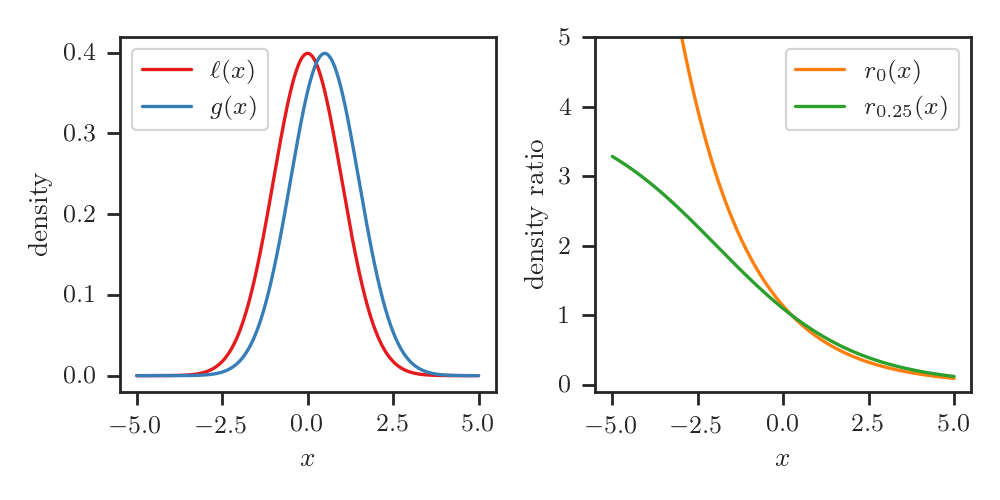
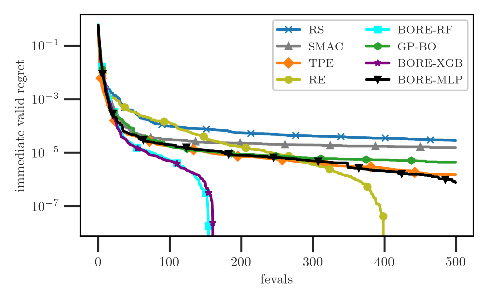

## Bayesian Optimization by Density-Ratio Estimation

***

**Louis Tiao**, Aaron Klein, Matthias Seeger, Cédric Archambeau, Edwin Bonilla and Fabio Ramos

Note:
- Hi. In this talk, we describe an approach to *Bayesian Optimization* by *Density Ratio Estimation*.
- My name is Louis Tiao, and this is a collaboration with Aaron Klein and my colleagues shown here.

---

## Blackbox optimization

Find input $\mathbf{x}$ that minimizes blackbox function $f(\mathbf{x})$
$$
\mathbf{x}\_{\star} = \operatorname{argmin}\_{\mathbf{x} \in \mathcal{X}}{f(\mathbf{x})}
$$

 <!-- .element height="60%" width="60%" class="plain" -->

Note:
First of all, some background: Bayesian optimization is one of the most effective and
widely-used methods for the *global* optimization of *blackbox* functions. 
- By *blackbox*, we usually mean that we only have access to
  - (potentially noisy) observations of the outputs at some given inputs,
  - and useful information such as gradients of the function are generally not available
- then we seek a minimum to this function using as few evaluations as possible 

---

## Bayesian Optimization

- **Probabilistic surrogate model**
  - using past observations $\mathcal{D}\_N = \\{ (\mathbf{x}\_n, y\_n) \\}\_{n=1}^N$
- **Acquisition function** that encodes the *explore-exploit* trade-off
  - derived from **posterior predictive** $p(y | \mathbf{x}, \mathcal{D}\_N)$
  - e.g. *expected improvement (EI)*
<!-- - Output $y \sim \mathcal{N}(f(\mathbf{x}), \sigma^2)$ observed with noise variance $\sigma^2$ -->

Note:
Briefly summarized, BO has *two* components:
- At the core of BO is the *probabilistic surrogate model* of the blackbox function, 
  - build on past observations of input-output pairs *D*,
- Then, BO works by proposing solutions according to an *acquisition function*, 
a function which encodes the trade-off between *exploration* and *exploitation*.
  - usually the acquisition function is built on the properties of surrogate 
  model's **posterior predictive** distribution *p(y|x, D)*.
  - in our talk, we'll be focusing on the widely-popular **expected improvement**, 
  or **EI**, acquisition function.

----

### Utility function: Improvement 

- Improvement over threshold $\tau$
  $$
  U(\mathbf{x}, y, \tau) = \max(\tau - y, 0)
  $$
- By convention, $\tau$ is lowest function value observed so far 
  $$
  \tau = \min\_{n=1, \dotsc, N} y\_n
  $$

Note:
First, let us define the improvement utility function, which quantifies the 
non-negative amount by which *y* improves upon some threshold *tau*.

----

### Expected Improvement (EI)

- Expected value of $U(\mathbf{x}, y, \tau)$
  $$
  \alpha\_{\gamma}(\mathbf{x}; \mathcal{D}\_N) = \mathbb{E}\_{\color{OrangeRed}{p(y | \mathbf{x}, \mathcal{D}\_N)}}[U(\mathbf{x}, y, \tau)]
  $$
  under posterior predictive $\color{OrangeRed}{p(y | \mathbf{x}, \mathcal{D}\_N)}$.

Note:
- Finally, we are ready to define the *expected improvement* function,
- which, as the name would suggest, is the *expected value* of the *improvement* 
utility function (just defined), under the **posterior predictive** of the surrogate model
- This explicitly reveals the dependency on the posterior predictive

----

### EI closed-form

- For **Gaussian** predictive
  $$
  p(y | \mathbf{x}, \mathcal{D}\_N) = \mathcal{N}(y | \mu(\mathbf{x}), \sigma^2(\mathbf{x})).
  $$ 
- We obtain an analytic expression
  $$
  \alpha(\mathbf{x}; \mathcal{D}\_N, \tau) = 
  \sigma(\mathbf{x}) \left [ \nu(\mathbf{x}) \Psi(\nu(\mathbf{x})) + \psi(\nu(\mathbf{x})) \right ]
  $$
  where $\nu(\mathbf{x}) = \frac{\tau - \mu(\mathbf{x})}{\sigma(\mathbf{x})}$, 
  and $\Psi, \psi$ denote the cdf and pdf of the normal distribution, resp.

Note:
- Furthermore, it should be noted that, if the predictive is *Gaussian*, this leads to a nice closed-form expression.
- It is for this reason (and many others) that the Gaussian process is arguably the *de facto*
probabilistic model for BO.

----

### Gaussian process regression

The case for Gaussian processes in BO: 
- expressive and flexible
- well-calibrated predictive uncertainty
- Gaussian-Gaussian conjugacy $\Rightarrow$ Gaussian predictive

----

### Limitations

- **GP-based BO** can also be hampered by the limitations of GPs
  - scalability: $\mathcal{O}(N^3)$ cost [(Titsias, 2009; more)](#)
  - non-stationarity [(Snoek et al, 2014)](#)
  - discrete inputs, ordered or otherwise (categorical) [(Garrido-Merchán and Hernández-Lobato, 2020)](#)
  - conditional dependency structures [(Jenatton et al, 2017)](#)
- **Beyond GPs:** analytical tractability of $\color{OrangeRed}{p(y | \mathbf{x}, \mathcal{D}\_N)}$ still poses limitations

Note:
- That said, BO based on GPs and also be hampered by their limitations. To name a few,
  - Their *exact* inference scales cubically
  - They assume stationarity
  - Don't deal well with with discrete inputs, or inputs with conditional dependencies.
- As such, to overcome these limitations, much focus has been directed toward extending GPs themselves.
- Further, when considering other models beyond GPs, the need to ensure analytical 
tractability of the predictive poses further limitations on the model's expressiveness.

----

## BO Reimagined

- **Surrogate model is only a means to an end** (i.e. of constructing the acquisition function)
- Alternative formulation?
  - _**bypass** posterior inference altogether?_

Note:
- So, to address these limitiations, 
  - instead of trying to patch the deficiencies of the surrogate model,
  - why don't we step back and re-consider the problem from a different angle.
- First, we must recognize that, at the end of the day, we care about the 
surrogate model insofar as we can use it to construct the acquisition function
- Naturally, we ought to ask: can we formulate the acquisition function in a 
way that doesn't demand analytical tractability on the part of the model.

---

## Density Ratio

The **density ratio** between $\ell(\mathbf{x})$ and $g(\mathbf{x})$
$$
\frac{\ell(\mathbf{x})}{g(\mathbf{x})}
$$

 <!-- .element height="70%" width="70%" class="plain" -->

Note:
Before we do this, let us first introduce some concepts. 
Namely, the *density ratio*:
- let *l* and *g* be a pair of probability distributions.
- Then, the *density ratio* between *l* and *g* is quite simply, the *ratio* of their *densities*.
- This is illustrated in the figure shown here.

----

### Relative Density Ratio

- The $\gamma$-**relative density ratio** between $\ell(\mathbf{x})$ and $g(\mathbf{x})$
$$
r\_{\gamma}(\mathbf{x}) = \frac{\ell(\mathbf{x})}{\gamma \ell(\mathbf{x}) + (1 - \gamma) g(\mathbf{x})}
$$
  where $\gamma \ell(\mathbf{x}) + (1 - \gamma) g(\mathbf{x})$ is the $\gamma$-*mixture density* 
  - for some mixing proportion $0 \leq \gamma < 1$
- For $\gamma = 0$ we recover **ordinary** density ratio $r\_0(\mathbf{x}) = \ell(\mathbf{x}) / g(\mathbf{x})$

Note:
- To generalize this slightly, we introduce the *relative* density ratio, 
which is defined as the ratio between *l* and the mixture density of *l* and *g*
with mixing proportion *gamma*.
- It's easy to see that we recover the *ordinary* density ratio simply by setting *gamma* equal to 0.

----

### Relative Density Ratio Illustrated

 <!-- .element height="90%" width="90%" class="plain" -->

Note:
This is the example from the previous illustration, now also showing the *gamma* relative density ratio with *gamma* set to 0.25.

----

## Ordinary and Relative Density Ratio

- $r\_{\gamma}(\mathbf{x})$ is a *strictly non-decreasing* function $h\_{\gamma}$ 
of $r\_0(\mathbf{x})$
$$
r\_{\gamma}(\mathbf{x}) = h\_{\gamma}\left(r\_0(\mathbf{x})\right)
$$
where
$$
h\_{\gamma}: u \mapsto \left(\gamma + u^{-1} (1 - \gamma)\right)^{-1}
$$

Note:
Before moving on, it is worth noting that the relative density ratio *r_gamma* 
can be expressed as a *monotonically non-decreasing* function of the ordinary 
density ratio *r_0*.

---

## EI as a Density Ratio

- Define $\tau$ as the $\gamma$-th quantile of the observed $y$ values $\tau = \Phi^{-1}(\gamma)$, where
  $$
  \gamma = \Phi(\tau) = p(y < \tau)
  $$

Note:
- We now discuss the conditions under which EI can be expressed as the relative density-ratio in the previous slides.
- To do this, let's first specify *tau* as a function of *gamma*, specifically, with *tau* being the *gamma*th quantile of the observed *y* values. 

----

### Threshold: Examples

1. $\gamma = 0.25$ leads to *first quartile*
2. $\gamma = 0$ leads to $\tau=\min\_n y\_n$ (i.e. the conventional definition)

 <!-- .element height="60%" width="60%" class="plain" -->

Note:
To illustrate we show some example settings of gamma and the thresholds they lead to.
- We're using the same blackbox function from the example in the beginning, along with its observations 
- In the right pane of the figure, we show the empirical CDF of *y* observations.
  - then, we can see that *gamma=0.25* corresponds to the first quartile of *y* observations, and
  - with *gamma=0* we recover the minimum across all *y* observations, which is the 
  conventional setting of the threshold for EI.

----

### Conditional Densities

1. Choose some $\gamma > 0$ and set $\tau = \Phi^{-1}(\gamma)$ 
2. Define densities $\ell(\mathbf{x})$ and $g(\mathbf{x})$: 
$$
\ell(\mathbf{x}) = p \left (\mathbf{x} | y \leq \tau, \mathcal{D}\_N \right),
\quad
g(\mathbf{x}) = p \left (\mathbf{x} | y > \tau, \\mathcal{D}\_N \right )
$$

 <!-- .element height="55%" width="55%" class="plain" -->

Notes:
- First we choose some positive *gamma* and determine *tau* accordingly
- Then, let's partition the observed inputs, such that 
  - if the corresponding output is less than *tau*, then it is distributed according to *l*,
  - otherwise, it is distributed according to *g*
- In this illustration, I've selected *gamma = 1/3* which leads to *tau* taking on the value marked by the horizontal dashed line. 
  - Every point below this line is in the smallest one-third of observed *y* values, and their density is shown in red
  - Likewise, every point above this line is in the largest two-thirds of observed *y* values, and their density is shown in blue

----

### EI as a Density-Ratio

- [Bergstra et al. 2011](#) demonstrate
$$
\underbrace{\alpha \left(\mathbf{x}; \mathcal{D}\_N, \Phi^{-1}(\gamma)\right)}\_\text{expected improvement} \propto \underbrace{r\_{\gamma}(\mathbf{x})}\_\text{relative density-ratio}
$$

Note:
- Then, remarkably, under these definitions, EI is equivalent to the relative density-ratio, up to a constant factor. 
- As was demonstrated by Bergstra et al. in 2011.

----

#### Sketch Proof I

- Instead of computing $\color{OrangeRed}{p(y | \mathbf{x}, \mathcal{D}\_N)}$ *directly*
$$
p(y | \mathbf{x}, \mathcal{D}\_N) = \int p(y | f) p(f | \mathbf{x}, \mathcal{D}\_N) \mathrm{d}f
$$
- Specify $\color{ForestGreen}{p(y)}$ and $\color{ForestGreen}{p(\mathbf{x} | y, \mathcal{D}\_N)}$, 
and represent $\color{OrangeRed}{p(y | \mathbf{x}, \mathcal{D}\_N)}$ *indirectly* through Bayes' rule
$$
\color{OrangeRed}{p(y | \mathbf{x}, \mathcal{D}\_N)} = 
\frac{\color{ForestGreen}{p(\mathbf{x} | y, \mathcal{D}\_N) p(y)}}{p(\mathbf{x} | \mathcal{D}\_N)}
$$

Notes:
- To give a high-level overview and provide some intuition on how this comes about, let's walk through a sketch proof
- Rather than the usual approach of specifying a model joint consisting of observed and latent variables, and then computing the predictive by marginalizing out the latent variables
- We instead specify the marginal *p(y)* and the conditional *p(x | y)*
- In this way, Bayes rule allows us to re-write the predictive in these terms

----

#### Sketch Proof II

$$
\begin{align}
  \alpha & (\mathbf{x}; \mathcal{D}\_N, \tau) \newline 
  & = \mathbb{E}\_{\color{OrangeRed}{p(y | \mathbf{x}, \mathcal{D}\_N)}}[\max(\tau - y, 0)] \newline 
  & = \int_{-\infty}^{\tau} (\tau - y) \color{OrangeRed}{p(y | \mathbf{x}, \mathcal{D}\_N)} \mathrm{d}y \newline
  & = \frac{1}{p(\mathbf{x} | \mathcal{D}\_N)} \int_{-\infty}^{\tau} (\tau - y) \color{ForestGreen}{p(\mathbf{x} | y, \mathcal{D}\_N)} \color{ForestGreen}{p(y | \mathcal{D}\_N)} \mathrm{d}y
\end{align}
$$

Notes:
- Write out the definition of EI
- Substitute occurrence of the predictive with the terms we just discussed 

----

#### Sketch Proof III

- Numerator
$$
\int_{-\infty}^{\tau} (\tau - y) \color{ForestGreen}{p(\mathbf{x} | y, \mathcal{D}\_N)} \color{ForestGreen}{p(y | \mathcal{D}\_N)} \mathrm{d}y \propto \ell(\mathbf{x})
$$
- Denominator
$$
p(\mathbf{x} | \mathcal{D}\_N) = \gamma \ell(\mathbf{x}) + (1 - \gamma) g(\mathbf{x})
$$

$$
\therefore \alpha(\mathbf{x}; \mathcal{D}\_N, \tau) \propto r\_{\gamma}(\mathbf{x})
$$

Notes:
- It is straightforward to verify 
  * that the numerator is proportional to *gamma*, and
  * that the denominator is the *gamma* mixture density of *l* and *g*
- Therefore, EI is proportional to the *gamma* relative density-ratio 

----

## Problem Reformulation

- Reduces maximizing *EI* to maximizing the *relative density-ratio*
$$
\begin{align}
\mathbf{x}\_{N+1} 
&= \color{OrangeRed}{\operatorname{argmax}\_{\mathbf{x} \in \mathcal{X}}{\alpha \left(\mathbf{x}; \mathcal{D}\_N, \Phi^{-1}(\gamma)\right)}} \newline
&= \color{green}{\operatorname{argmax}\_{\mathbf{x} \in \mathcal{X}}{r\_{\gamma}(\mathbf{x})}}
\end{align}
$$

Note:
- So to recapitulate: since EI is proportional to the relative ratio, we can reduce the 
problem of maximizing the former to that of maximizing the latter.
- Thus, effectively allowing us to bypass posterior inference in the surrogate
model.

---

## Tree-structured Parzen Estimator (TPE)

TPE approach [(Bergstra et al. 2011)](#) for maximizing $r\_{\gamma}(\mathbf{x})$
1. Maximize $r\_0(\mathbf{x})$ instead
$$
\begin{align}
\mathbf{x}\_{\star} 
&= \color{OrangeRed}{\operatorname{argmax}\_{\mathbf{x} \in \mathcal{X}}{r\_{\gamma}(\mathbf{x})}} \newline
&= \color{ForestGreen}{\operatorname{argmax}\_{\mathbf{x} \in \mathcal{X}}{r\_0(\mathbf{x})}}
\end{align}
$$

Note:
- So now we're left with the problem of maximizing *r_gamma*.
- To do this Bergstra et al. propose the TPE method, which makes two choices.
- First, recall from earlier that r_gamma is a **monotonically non-decreasing** function
of *r_0*. 
- Therefore, they simply restrict their attention to maximizing *r_0* instead. 

----

### Shortcomings

- **Singularities.** $r\_0(\mathbf{x})$ is often undefined.
  In contrast, $r\_{\gamma}(\mathbf{x})$ is always well-defined 
  - bounded above by $\gamma^{-1}$ when $\gamma > 0$ [(Yamada et al. 2011)](#)
  - easy to find examples e.g. $\ell(x) = \mathcal{N}(0, 1)$ and $g(x) = \mathcal{N}(0.5, 1)$

 <!-- .element height="50%" width="50%" class="plain" -->

Note:
While this may seem like a nice simplification, it may have unintended 
consequences. In particular, 
- r_0 is unbounded, often diverging to infinity even in simple toy scenarios.
- By contrast r_gamma is always bounded above by *gamma-inverse* for all 
positive *gamma*
- It is easy to find examples of this. In particular, take a zero-mean, 
unit-variance Normal distribution. By shifting the mean by 0.5 and taking the
density ratios, we find that r_0 diverges to infinity while r_gamma remains
upper bounded by 4, which is equivalent to *gamma-inverse* for *gamma = 0.25*.

----

## Tree-structured Parzen Estimator (TPE) II

2. To estimate $r\_0(\mathbf{x})$  
  - separately estimate $\ell(\mathbf{x})$ and $g(\mathbf{x})$ using a 
  tree-based variant of **kernel density estimation (KDE)**
  - take the ratio of the estimators

Note:
The next component of the TPE approach is to estimate r_0, which they do 
simply by 
- individually estimating *l* and *g* using a tree-based variant of kernel 
density estimation, and then
- taking the ratio of these estimators

----

## TPE Advantages

- Computational cost $\mathcal{O}(N)$ instead of $\mathcal{O}(N^3)$ in GP inference
- Equipped to handle tree-structured, continuous, and discrete (ordered and unordered) inputs

Note:
It's clear why this approach may be favorable compared to GP regression.
- We we now incur a linear cost as opposed to the cubic complexity of 
posterior inference in GPs
- Furthermore, it is naturally equipped to deal with tree-structured, continuous, and discrete inputs.
- In spite of these advantages, TPE is not without its shortcomings, as we 
discuss next.

----

## Shortcomings II

- **Vapnik's principle.** *When solving a problem, don't try to solve a more general problem as an intermediate step*
  - *density* estimation is arguably more general and difficult problem than *density ratio* estimation

Note:

In particular, estimating the individual densities is actually a more 
cumbersome approach for a number of reasons. 
Firstly, it violates Vapnik's principle, paraphrased, suggests to us that when 
solving a problem of interest, one should refrain from solving a 
more general problem as an intermediate step.
- And in this instance, *density* estimation is a more general problem; 
  arguably one that is more difficult than *density ratio* estimation.

----

### Shortcomings III

- **Kernel bandwidth.** KDE depends crucially on the selecting
appropriate kernel bandwidths
- **Error sensitivity.** Estimating *two* densities 
  - Optimal bandwidth for estimating a *density* may be detrimental to estimating the *density ratio*
  - Unforgiving to errors in denominator $g(\mathbf{x})$

Note:
- One of the things that make density estimation so hard is the 
selection of the kernel bandwidth, which is notoriously difficult.
- This is exacerbated by the fact that we need to simultaneously estimate *two* 
densities, 
  - wherein the optimal bandwidth for one of the individual densities 
  may be detrimental to estimating the density ratio as a whole.
  - This factor makes this approach unforgiving to any error in estimating the 
  individual densities, particularly in that of the denominator *g* which has 
  an outsized influence on the resulting density ratio

----

### Shortcomings IV

- **Curse of dimensionality.** KDE often struggles in higher dimensions.
- **Ease of optimization.** Need to maximize ratio of KDEs for candidate suggestion.

Note:
- For these reasons and more, KDE often falls short in higher dimensions
- And finally, we ultimately care about *optimizing* the density ratio 
in order to suggest candidates. The ratio of KDEs of cumbersome to work with 
in this regard.

----

## Solutions?

- How to avoid the pitfalls of the TPE approach?
  - _**directly** estimate the relative density ratio_

Note:
- Given all these pitfalls we discussed, it stands to reason that we should be
looking for ways to *directly estimate* the relative density ratio.

---

## Density-Ratio Estimation 

- CPE: Class-Probability Estimation (Qin 1998, Bickel et al. 2007) 
- KMM: Kernel Mean Matching (Huang et al. 2007) 
<!-- .element: class="fragment fade-out" data-fragment-index="1" -->
- KLIEP: KL Importance Estimation Procedure (Sugiyama et al. 2008) 
<!-- .element: class="fragment fade-out" data-fragment-index="1" -->
- (R)uLSIF : (Relative) Least-squares Important Fitting (Kanamori et al. 2009; Yamada et al. 2011) 
<!-- .element: class="fragment fade-out" data-fragment-index="1" -->

Note:
And how can we go about this? Well, 
- Many density-ratio estimation methods have been developed, some of which are quite sophisticated.
- But for now let's just see how far we can get with the most conceptually simple of them all, which is arguably *class-probability estimation*.

----

## Class-Probability Estimation (CPE)

- Density-ratio estimation is tightly-linked to class-probability estimation
[(Qin 1998, Bickel et al. 2007)](#)
- What about **relative** density-ratio estimation?

Note:
- It's been long-established that **density-ratio estimation** is closely-linked to **probabilistic classification**.
- Therefore, it stands to reason that this link can be extended to the **relative** density-ratio as well.

----

## Classification Problem

- Let $\pi(\mathbf{x})$ abbreviate **class-posterior probability**
  $$
  \pi(\mathbf{x}) = p(z = 1 | \mathbf{x})
  $$
  where $z$ is binary class label
  $$
  z =
  \begin{cases} 
    1 & \text{if } y \leq \tau, \newline
    0 & \text{if } y > \tau
  \end{cases}
  $$

Note:
- First, we let *pi* denote the *class-posterior probability*, that is, the 
  *class-membership probability* of *x* belonging to the positive class,
- and the classes are labeled such that
  - *x* belongs to the positive class if output *y* is less than *tau*,
  - otherwise, it belongs to the negative class 

----

### Relationship: Density-Ratio and Class-Posterior Probability

<!-- 
- ordinary density ratio
$$
r\_0(\mathbf{x}) = \left ( \frac{\gamma}{1 - \gamma} \right )^{-1} \frac{\pi(\mathbf{x})}{1 - \pi(\mathbf{x})}
$$ -->

- The $\gamma$-relative density-ratio is equivalent to the class-posterior 
probability up to constant factor $\gamma^{-1}$
$$
\underbrace{r\_{\gamma}(\mathbf{x})}\_\text{relative density-ratio} = 
\gamma^{-1}
\times
\underbrace{\pi(\mathbf{x})}\_\text{class-posterior probability} 
$$

Note:
Then, it is easy to verify that relative density ratio is exactly equivalent 
to the class-posterior probability, up to constant factor *gamma inverse*.

----

## Quick Recap

$$
\begin{align}
\underbrace{\alpha \left(\mathbf{x}; \mathcal{D}\_N, \Phi^{-1}(\gamma)\right)}\_\text{expected improvement} 
& \propto \underbrace{r\_{\gamma}(\mathbf{x})}\_\text{relative density-ratio} \newline
& \propto \underbrace{\pi(\mathbf{x})}\_\text{class-posterior probability} 
\end{align}
$$

- This is good news! <!-- .element: class="fragment fade-in-then-out" -->
- Class-posterior probability $\pi(\mathbf{x})$ can be approximated by training a probabilistic classifier! <!-- .element: class="fragment" -->

Note: 
So, just to quickly recap:
- EI is proportional to the relative density ratio, which is in turn 
proportional to the class-posterior probability.
- This is actually great news, because we can approximate the last of these
simply by training a probabilistic classifier.

---

### Compute EI by Classification

- Computing EI $\Leftrightarrow$ learning a probabilistic classifier
  - Retain the advantages of TPE and avoid its pitfalls
  - Enjoy the benefits of different state-of-the-art classifiers
  - Build arbitrarily expressive classifiers

Note:

So, we've now reduced the problem of computing EI to that of training 
a classifier, which is something we know how to do pretty well,
- this allows us to enjoy the strengths offered by different classifiers,
- all the while, retaining the advantages of TPE while avoiding its pitfalls
- depending on the choice of classifier, we can build arbitrarily expressive 
approximators that have the capacity to deal to with complex, non-linear and 
non-stationary phenomena.

---

## Choice of Probabilistic Classifier

----

### Neural networks

*Multi-layer Perceptron (MLP)*

- Upsides: 
  1. universal approximation
  2. easily scalable with stochastic optimization
  3. differentiable end-to-end wrt inputs $\mathbf{x}$
- Downside: Data-intensive

Notes:
An obvious candidate for parameterizing this classifier is a neural network,
- not only for their universal approximation guarantees,
- but also because it is easy to scale up their parameter learning with 
stochastic optimization.
- This is not to mention they are differentiable end-to-end wrt inputs *x*, which
means we can take advantage of methods like L-BFGS for candidate suggestion.
- Since they tend to be overparameterized, a notable weakness is that they are 
considerably data-hungry and may not be suitable for sparse data regimes. 

----

### Tree-based ensembles 

*Random forests (RF)* and *gradient-boosted trees (XGBoost)*

- Upsides: 
  1. deal well with discrete and conditional inputs, by design
  2. scale to high-dimensions
  3. scalable and highly-parallelizable
- Downside: Hard to optimize

---

## Algorithm

- Classifier $\pi\_{\boldsymbol{\theta}}(\mathbf{x})$ with parameters $\boldsymbol{\theta}$
  1. **Train classifier** $\boldsymbol{\theta}^{*} \gets \operatorname{argmin}\_{\boldsymbol{\theta}} \mathcal{L}(\boldsymbol{\theta})$ (loss $\mathcal{L}$) 
  2. **Suggest candidate** $\mathbf{x}\_N \gets \operatorname{argmax}\_{\mathbf{x} \in \mathcal{X}} \pi\_{\boldsymbol{\theta}}(\mathbf{x})$
  3. **Evaluate** $y\_N \gets f(\mathbf{x}\_N)$
  4. **Update dataset** $\mathcal{D}\_N \gets \mathcal{D}\_{N-1} \cup \{ (\mathbf{x}\_N, y\_N) \}$
  5. **Repeat** 1.

Note:
To summarize the algorithm, the so-called BO loop looks like this.
- Let *pi_theta* be the classifier with parameters *theta*
1. Then, we train the classifier by minimizing parameters *theta* wrt an 
appropriate classification loss, such as the log-loss.
2. We suggest a candidate by maximizing input *x* wrt the classifier.
3. Then we evaluate the function at the suggested point, and update the dataset as usual
4. And then we repeat this until some budget is exhausted.

----

### Code: Model Definition

<pre>
<code data-line-numbers="4|7-14">
import numpy as np

from bore.models import MaximizableSequential
from tensorflow.keras.layers import Dense

# build model
classifier = MaximizableSequential()
classifier.add(Dense(16, activation="relu"))
classifier.add(Dense(16, activation="relu"))
classifier.add(Dense(1, activation="sigmoid"))

# compile model
classifier.compile(optimizer="adam", loss="binary_crossentropy")
</code>
</pre>

Note:
- For the BORE variant based on a feed-forward neural network, or multi-layer perceptron
- Subclass Sequential from Keras that adds one additional method
- Everything else remains the same, as we can see here.
- We specify a sequence of Dense, or fully-connected, layers.

----

### Code: Optimization Loop

<pre>
<code data-line-numbers="2-7|11-16|18-19|21-24|26-27|29-31">
features = []
targets = []

# initial designs
features.extend(features_init)
targets.extend(targets_init)

for i in range(num_iterations):

    # construct classification problem
    X = np.vstack(features)
    y = np.hstack(targets)

    tau = np.quantile(y, q=0.25)
    z = np.less(y, tau)

    # update classifier
    classifier.fit(X, z, epochs=200, batch_size=64)

    # suggest new candidate
    x_next = classifier.argmax(method="L-BFGS-B", 
                               num_start_points=3,
                               bounds=bounds)

    # evaluate blackbox
    y_next = blackbox.evaluate(x_next)

    # update dataset
    features.append(x_next)
    targets.append(y_next)
</code>
</pre>

---

# Results

Note:
So, how well does this actually work?

---

### HPOBench

> Train two-layer fully-connected network on various regression datasets.

- Klein, A., & Hutter, F. (2019). **Tabular benchmarks for joint architecture and hyperparameter optimization**. *arXiv preprint arXiv:1905.04970*.

----

#### HPOBench Naval

 <!-- .element height="80%" width="80%" class="plain" -->

----

#### HPOBench Parkinsons

 <!-- .element height="80%" width="80%" class="plain" -->

----

#### HPOBench Protein

 <!-- .element height="80%" width="80%" class="plain" -->

----

#### HPOBench Slice

 <!-- .element height="80%" width="80%" class="plain" -->

---

### NASBench201

 <!-- .element height="50%" width="50%" class="plain" -->

- Dong, X., & Yang, Y. (2019, September). **NAS-Bench-201: Extending the Scope of Reproducible Neural Architecture Search.** In *International Conference on Learning Representations*.

----

#### NASBench201 CIFAR10

 <!-- .element height="80%" width="80%" class="plain" -->

----

#### NASBench201 CIFAR100

 <!-- .element height="80%" width="80%" class="plain" -->

----

#### NASBench201 ImageNet16

 <!-- .element height="80%" width="80%" class="plain" -->

---

### Racing Line Optimization

- Jain, A., & Morari, M. (2020, December). **Computing the racing line using Bayesian optimization**. In *2020 59th IEEE Conference on Decision and Control (CDC)* (pp. 6192-6197). IEEE.

----

#### Racing (UC Berkeley)

 <!-- .element height="80%" width="80%" class="plain" -->

----

#### Racing (ETH Zurich A)

 <!-- .element height="80%" width="80%" class="plain" -->

----

#### Racing (ETH Zurich B)

 <!-- .element height="80%" width="80%" class="plain" -->

---

### Additional Benchmarks

----

#### Robot Pushing

 <!-- .element height="80%" width="80%" class="plain" -->

---

## Final Recap

1. Problem of computing EI can be reduced to that of probabilistic classification
$$
\underbrace{\alpha\_{\gamma}(\mathbf{x}; \mathcal{D}\_N)}\_\text{expected improvement} \propto \underbrace{r\_{\gamma}(\mathbf{x})}\_\text{relative density ratio}
\propto \underbrace{\pi(\mathbf{x})}\_\text{class-posterior probability} 
$$
2. The TPE method falls short in important ways
3. Simple implementation based on feed-forward NN delivers promising results

Note:
- In this talk, we discussed how the problem of *computing EI* can be reduced to 
that of *probabilistic classification*. 
- This observation is made through 
  * the well-known link between **probabilistic classification** and **density ratio estimation**, and 
  * the lesser-known insight that EI 
can be expressed as the **relative density ratio** between two unknown 
distributions.
- We dissected the TPE method: an approach to exploit the latter link, and discussed its failure modes.
- Finally, we proposed an alternative that avoids these failure modes, and showed that a simple implementation of this competes favorably with SOTA methods.

---

## Conclusion

- **Simplicity** and **effectiveness** makes BORE an attractive approach
- **Extensibility** of the BORE framework offers numerous exciting avenues for future exploration 

Note:
Overall, we conclude that
- BORE is a simple but effective framework for BO
- Its high degree of extensibility offers many promising future directions

---

## Thanks for watching!

Note:
- Thank you very much for watching
- I am looking forward to having discussions with you :)

---

## References

- Bergstra, J. S., Bardenet, R., Bengio, Y., & Kégl, B. (2011). Algorithms for Hyper-parameter Optimization. In *Advances in Neural Information Processing Systems* (pp. 2546-2554).
- Yamada, M., Suzuki, T., Kanamori, T., Hachiya, H., & Sugiyama, M. (2011). Relative Density-ratio Estimation for Robust Distribution Comparison. In *Advances in Neural Information Processing Systems* (pp. 594-602).

----

## References II
