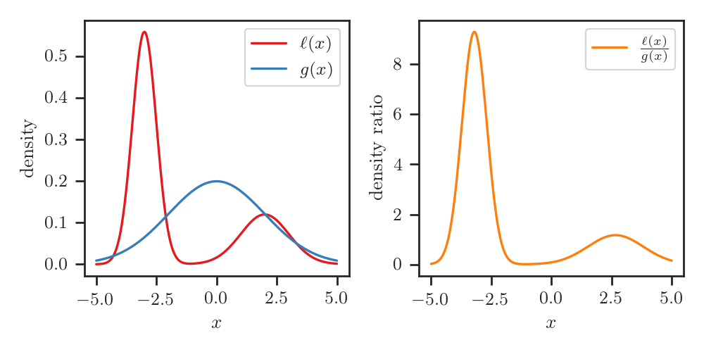
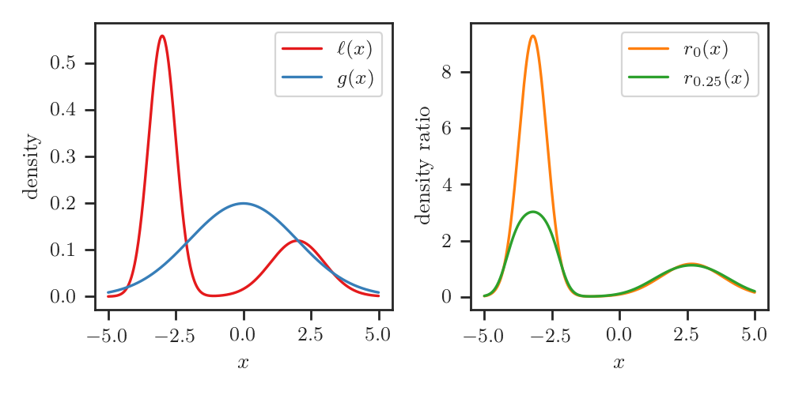
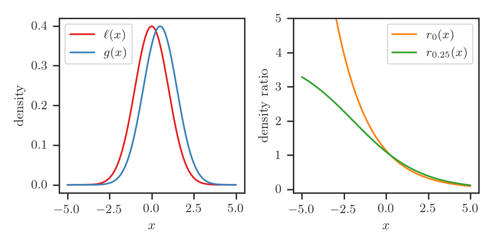
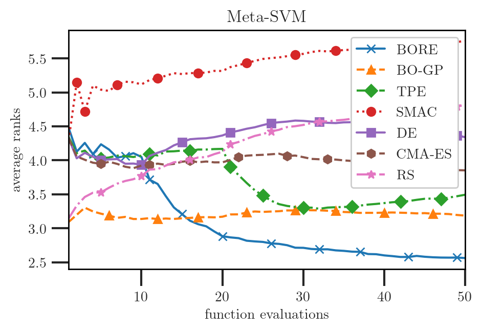
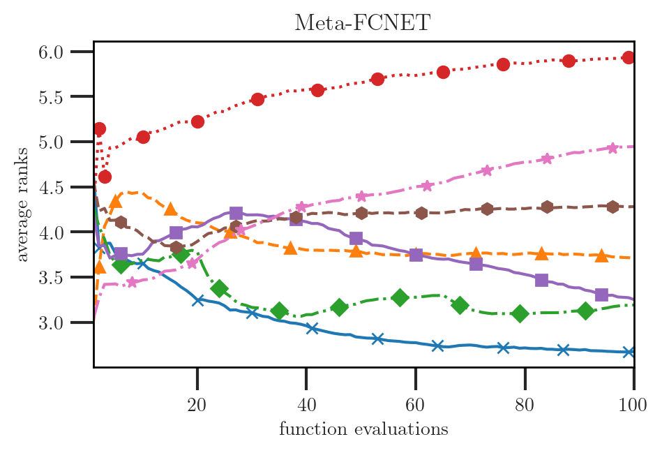
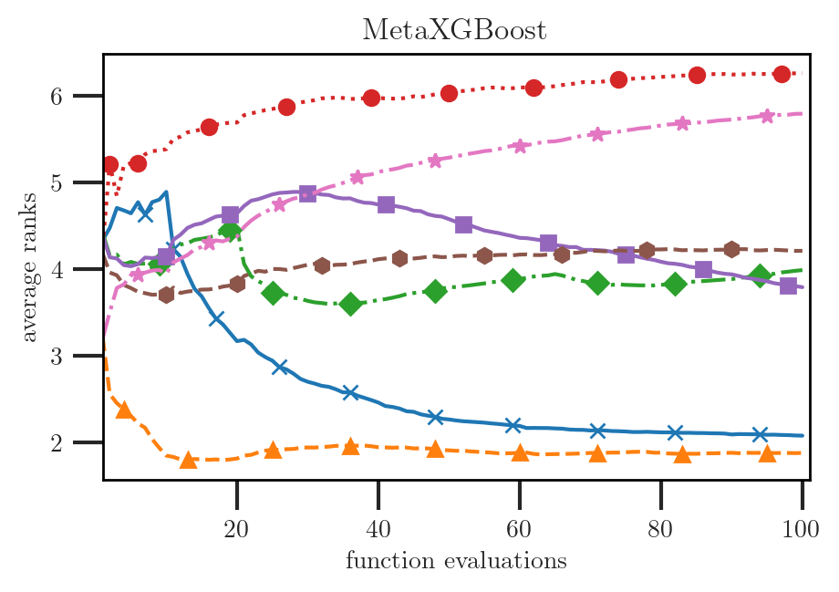

## Bayesian Optimization by Density Ratio Estimation

***

**Louis Tiao**, Aaron Klein, Cédric Archambeau, Edwin Bonilla, Matthias Seeger, and Fabio Ramos

Note:
- Hi, I am Louis Tiao, and in this talk, we will discuss *BORE*, an approach to *Bayesian Optimization through Density Ratio Estimation*.
- This is joint work done with Aaron Klein, and other collaborators listed here.

---

## Blackbox optimization

Find input $\mathbf{x}$ that minimizes blackbox function $f(\mathbf{x})$
$$
\mathbf{x}^{\star} = \operatorname{argmin}\_{\mathbf{x} \in \mathcal{X}}{f(\mathbf{x})}
$$

 <!-- .element height="60%" width="60%" class="plain" -->

Note:
First of all, some background: Bayesian optimization is one of the most effective and
widely-used methods for the *global* optimization of *blackbox* functions. 
- By *blackbox*, we usually mean that we observe *no other* information about 
  the function, other than its outputs given some inputs *x*,
  - in particular, gradients of the function are not available
- In the figure shown on this slide, we see
  - noisy observations of the outputs plotted against their corresponding inputs, 
  - and these are shown against the backdrop of the latent blackbox function 
  which we cannot directly observe, but nonetheless wish to minimize

---

## Bayesian Optimization

- **Probabilistic surrogate model**
  - using past observations $\mathcal{D}\_N = \\{ (\mathbf{x}\_n, y\_n) \\}\_{n=1}^N$
- **Acquisition function** that encodes the explore-exploit trade-off
  - derived from posterior predictive distribution $p(y | \mathbf{x}, \mathcal{D}\_N)$
  - e.g. *expected improvement (EI)*
<!-- - Output $y \sim \mathcal{N}(f(\mathbf{x}), \sigma^2)$ observed with noise variance $\sigma^2$ -->

Note:
Briefly summarized, BO has *two* components:
- At the core of BO is the *probabilistic surrogate model* of the blackbox function, 
  - which is learned from the past observations of input-output pairs *D*,
  - and that can provide uncertainty estimates over outputs
- Then, BO works by proposing solutions according to an *acquisition function*, 
a function which encodes the trade-off between exploration and exploitation.
  - usually the acquitision function is built on the properties of surrogate 
  model's posterior predictive distribution.
  - in our talk, we'll be focussing on the widely-popular **expected improvement**, 
  or **EI**, acquisition function.

----

### Utility function: Improvement 

- Improvement over threshold $\tau$
$$
I\_{\gamma}(\mathbf{x}) = \max(\tau - y, 0)
$$
- Note
  - $y$ is a function of $\mathbf{x}$
  - $\tau$ is a function of $\gamma$ (defined next)

Note:
First, let us define the improvement utility function, which quantifies the 
amount of non-negative improvement over some threshold tau.
Note that:
- y is a function of x, doesn't explicitly appear on the right-hand side
- similarly, tau is a function of gamma, which also doesn't appear on the right-hand side,
  and which will be defined next.

----

### Threshold

- Define threshold $\tau = \Phi^{-1}(\gamma)$ 
  - where $\gamma \in [0, 1)$ is some quantile of observed $y$, i.e.
$$
\gamma = \Phi(\tau) = p(y < \tau)
$$

Note:
- We let *tau* be specified through a function of *gamma*, namely the *inverse CDF* 
of the observed *y* values.
- In other words, *tau* is some pre-specified quantile of the *y* values.

----

### Threshold: Examples

1. $\gamma = 0.25$ leads to first quartile
2. $\gamma = 0$ leading to $\tau=\min\_n y\_n$ (conventional defn.)

 <!-- .element height="60%" width="60%" class="plain" -->

Note:
- Here we show some examples settings of gamma and the thresholds they lead to.
- We're using the same blackbox function and its observations from the example 
in the beginning.
- In the right pane of the figure, we show the empirical CDF of *y* observations.
  - then, we can see that *gamma=0.25* leads to the first quartile of *y* observations, and
  - *gamma=0* leads to the minimum across all *y* observations, which is the 
  conventional setting of the threshold for EI.

----

## Expected Improvement (EI)

- Expected value of $I\_{\gamma}(\mathbf{x})$
$$
\alpha\_{\gamma}(\mathbf{x}; \mathcal{D}\_N) = \mathbb{E}\_{\color{red}{p(y | \mathbf{x}, \mathcal{D}\_N)}}[I\_{\gamma}(\mathbf{x})]
$$
  - under posterior predictive $p(y | \mathbf{x}, \mathcal{D}\_N)$
- For Gaussian $p(y | \mathbf{x}, \mathcal{D}\_N)$, this leads to a simple 
analytical expression, **but also imposes constraints**

Note:
- Finally, we are ready to define the *expected improvement* function,
- which, as the name would suggest, is the *expected value* of the *improvement* 
utility function (just defined), under the *posterior predictive* of the surrogate model. 
- This reveals the requirement of analytical tractability of the posterior.

----

## Limitations

- Analytical tractability of $\color{red}{p(y | \mathbf{x}, \mathcal{D}\_N)}$ 
  poses limitations
  - scalability
  - stationarity and homeoscedasticity
  - discrete variables, ordered or otherwise (categorical)
  - conditional dependency structures

----

## BO Reimagined

- *The surrogate model is only a means to an end*
  - i.e. constructing the acquisition function
- Alternative formulation?
  - bypass posterior inference altogether?

Note:
- To address these limitiations, 
  - rather than trying to patch the deficiencies of the surrogate model
  - let us step back and re-consider the problem from a different angle
- First, we must recognize that, at the end of the day, we care about the 
surrogate model insofar as we can use it to construct the acquisition function
- Can we formulate the acquisition function in such a way as to bypass 
posterior inference in the surrogate model altogether?

---

## Density Ratio

The density ratio between $\ell(\mathbf{x})$ and $g(\mathbf{x})$
$$
\frac{\ell(\mathbf{x})}{g(\mathbf{x})}
$$

 <!-- .element height="70%" width="70%" class="plain" -->

Note:
To do this, let us first introduce the *density ratio*. Namely,
- let *l(x)* and *g(x)* be a pair of probability distributions.
- Then, the *density ratio* between *l(x)* and *g(x)* is simply the ratio of 
their densities.

----

## Relative Density Ratio

- The $\gamma$-*relative* density ratio between $\ell(\mathbf{x})$ and $g(\mathbf{x})$
$$
r\_{\gamma}(\mathbf{x}) = \frac{\ell(\mathbf{x})}{\gamma \ell(\mathbf{x}) + (1 - \gamma) g(\mathbf{x})}
$$
  where $\gamma \ell(\mathbf{x}) + (1 - \gamma) g(\mathbf{x})$ is the $\gamma$-*mixture density* 
  - for some mixing proportion $0 \leq \gamma < 1$
- For $\gamma = 0$ we recover *ordinary* density ratio
$$
r\_0(\mathbf{x}) = \frac{\ell(\mathbf{x})}{g(\mathbf{x})}
$$

Note:
Let us consider a slight generalization

----

### Relative Density Ratio Illustrated

 <!-- .element height="90%" width="90%" class="plain" -->

----

## Ordinary and Relative Density Ratio

- The relative density ratio $r\_{\gamma}(\mathbf{x})$ as a function of the 
ordinary density ratio $r\_0(\mathbf{x})$
$$
r_{\gamma}(\mathbf{x}) = ( \gamma + r_0(\mathbf{x})^{-1} (1 - \gamma) )^{-1}
$$
- Monotonically non-decreasing

Note:
Before moving on, please keep in mind that the relative density ratio *r-gamma* 
can be expressed as a *monotonically non-decreasing* function of the ordinary 
density ratio *r-zero*.

---

## BORE: BO by DRE

- Let $\ell(\mathbf{x})$ and $g(\mathbf{x})$ be distributions such that
  - $\mathbf{x} \sim \ell(\mathbf{x})$ if $y < \tau$
  - $\mathbf{x} \sim g(\mathbf{x})$ if $y \geq \tau$

 <!-- .element height="60%" width="60%" class="plain" -->

Note:
- Now we get to the crux of our work
- In other words, we assume that *x* is distributed according to *l(x)* if its 
corresponding target metric *y < tau*, otherwise, it is distributed according 
to *g(x)*

----

## Define Conditional

- Instead of predictive $p(y | \mathbf{x}, \mathcal{D}\_N)$
  - Specify $p(\mathbf{x} | y, \mathcal{D}\_N)$ in terms of $\ell(\mathbf{x})$ and 
$g(\mathbf{x})$
$$
p(\mathbf{x} | y, \mathcal{D}\_N) = 
\begin{cases} 
  \ell(\mathbf{x}) & \text{if } y < \tau, \newline
  g(\mathbf{x}) & \text{if } y \geq \tau
\end{cases}
$$

----

### Relationship: EI and Density Ratio

- [Bergstra et al. 2011](#) demonstrate
$$
\underbrace{\alpha\_{\gamma}(\mathbf{x}; \mathcal{D}\_N)}\_\text{expected improvement} \propto \underbrace{r\_{\gamma}(\mathbf{x})}\_\text{relative density ratio}
$$

Note:
- Under this construction, Bergstra et al. in 2011 showed that EI is equivalent
to the *gamma*-relative density ratio, up to a constant factor. 

----

## Problem Reformulation

- Reduce maximizing EI to maximizing the relative density ratio
$$
\begin{align}
\mathbf{x}\^{\star} 
&= \color{red}{\operatorname{argmax}\_{\mathbf{x} \in \mathcal{X}}{\alpha\_{\gamma}(\mathbf{x}; \mathcal{D}\_N)}} \newline
&= \color{green}{\operatorname{argmax}\_{\mathbf{x} \in \mathcal{X}}{r\_{\gamma}(\mathbf{x})}}
\end{align}
$$

Note:
- Since EI is proportional to the relative ratio, we can reduce the problem of 
maximizing EI to that of maximizing the relative ratio.
- Thus allowing us to bypass posterior inference

---

## Tree-structured Parzen Estimator (TPE)

TPE approach [(Bergstra et al. 2011)](#) for maximizing $r\_{\gamma}(\mathbf{x})$
1. Ignore $\gamma$
$$
\begin{align}
\mathbf{x}\^{\star} 
&= \operatorname{argmax}\_{\mathbf{x} \in \mathcal{X}}{\color{red}{r\_{\gamma}(\mathbf{x})}} \newline
&= \operatorname{argmax}\_{\mathbf{x} \in \mathcal{X}}{\color{green}{r\_0(\mathbf{x})}}
\end{align}
$$

----

## Shortcomings

- **Singularities.** $r\_0(\mathbf{x})$ is often undefined.
  In contrast, $r\_{\gamma}(\mathbf{x})$ is always well-defined 
  - bounded above by $\gamma^{-1}$ when $\gamma > 0$ [(Yamada et al. 2011)](#)
  - easy to find examples e.g. $\ell(x) = \mathcal{N}(0, 1)$ and $g(x) = \mathcal{N}(0.5, 1)$

 <!-- .element height="50%" width="50%" class="plain" -->

----

## Tree-structured Parzen Estimator (TPE) II

2. Tree-based variant of kernel density estimation (KDE)
  - separately estimate $\ell(\mathbf{x})$ and $g(\mathbf{x})$
  - estimate $r\_0(\mathbf{x})$ using the ratio of these estimates  

----

## Shortcomings II

- **Vapnik's principle.** "When solving a problem, don't try to solve a more general problem as an intermediate step"
  - *density* estimation is arguably more general and difficult problem than *density ratio* estimation

Note:

Vapnik's principle, paraphrased, suggests to us that when solving a problem of 
interest, one should refrain from resorting to solve a more general problem as 
an intermediate step.
- And in this instance, *density* estimation is a more general problem that is 
arguably more difficult than *density ratio* estimation.

----

## Shortcomings III

- **Kernel bandwidth.**
- **Error sensitivity.**
- **Curse of dimensionality.**
- **Ease of optimization.**

----

## Solutions?

- How to avoid the pitfalls of the TPE approach?
  - _**directly** estimate the relative density ratio_

Note:
- Given all these pitfalls we discussed, it stands to reason that we should be
looking for ways to *directly estimate* the relative density ratio.

---

## Density Ratio Estimation 

- KMM: Kernel Mean Matching (Huang et al. 2007) 
<!-- .element: class="fragment fade-out" data-fragment-index="2" -->
- KLIEP: KL Importance Estimation Procedure (Sugiyama et al. 2008) 
<!-- .element: class="fragment fade-out" data-fragment-index="2" -->
- (R)uLSIF : (Relative) Least-squares Important Fitting (Kanamori et al. 2009; Yamada et al. 2011) 
<!-- .element: class="fragment fade-out" data-fragment-index="2" -->
- CPE: Class-Probability Estimation (Qin 1998, Bickel et al. 2007) 
<!-- .element: class="fragment fade-up" data-fragment-index="1" -->

Note:
- A wealth of knowledge has been built up on the subject of density ratio 
estimation, and a number of sophisticated methods have been developed, but let 
us just see how far we can get with a simple baseline.
- Namely, that of *class-probability estimation*.

----

## Class-Probability Estimation (CPE)

Density ratio estimation is tightly-linked to class-probability estimation
(Qin 1998, Bickel et al. 2007)

Note:

----

## Classification Problem

- Introduce binary label $z$
$$
z =
\begin{cases} 
  1 & \text{if } y < \tau, \newline
  0 & \text{if } y \geq \tau
\end{cases}
$$
- Let $\pi(\mathbf{x})$ abbreviate class-posterior probability 
$$
\pi(\mathbf{x}) = p(z = 1 | \mathbf{x})
$$

----

### Relationship: Density Ratio and Class-Posterior Probability

<!-- 
- ordinary density ratio
$$
r\_0(\mathbf{x}) = \left ( \frac{\gamma}{1 - \gamma} \right )^{-1} \frac{\pi(\mathbf{x})}{1 - \pi(\mathbf{x})}
$$ -->

- The $\gamma$-relative density ratio is equivalent to the class-posterior 
probability up to constant factor
$$
\underbrace{r\_{\gamma}(\mathbf{x})}\_\text{relative density ratio} = 
\gamma^{-1}
\cdot
\underbrace{\pi(\mathbf{x})}\_\text{class-posterior probability} 
$$

Note:
- It is well-known that the ordinary density ratio estimation is closely-linked 
to class-probability estimation.
- Therefore, it stands to reason that the relative density ratio is related in 
some way as well.
- It turns out, it is easy to verify that relative density ratio is exactly 
equivalent to the class-posterior probability, up to constant factor 
one-over-*gamma*

----

## Quick Recap

$$
\underbrace{\alpha\_{\gamma}(\mathbf{x}; \mathcal{D}\_N)}\_\text{expected improvement} \propto \underbrace{r\_{\gamma}(\mathbf{x})}\_\text{relative density ratio}
\propto \underbrace{\pi(\mathbf{x})}\_\text{class-posterior probability} 
$$

This is great news! <!-- .element: class="fragment fade-in-then-out" -->

Class-posterior probability $\pi(\mathbf{x})$ can be approximated by training
a probabilistic classifier! <!-- .element: class="fragment" -->

---

## EI by Classifier Training

- We've reduced the problem of computing EI to that of training a classifier
  - Something we know how to do well
  - Enjoy the strengths and benefits of different state-of-the-art classifiers

Note:

We've reduced the problem of computing EI to that of training a classifier
- Something we know how to do pretty well
- Enjoy the strengths and benefits that different state-of-the-art classifiers 
have to offer

----

### Example: Neural Network Classifier

An obvious choice is a *feed-forward neural network*
- universal approximation
- easily scalable with stochastic optimization
- differentiable end-to-end wrt inputs $\mathbf{x}$

Notes:
- last but not least, differentiable end-to-end wrt inputs x

---

## BO Loop

Code

---

# Results

---

## Challenging synthetic test problems

----

## Branin (2D)

 <!-- .element height="80%" width="80%" class="plain" -->

----

## Six-hump Camel (2D)

 <!-- .element height="80%" width="80%" class="plain" -->

----

## Michalewicz5D (5D)

 <!-- .element height="80%" width="80%" class="plain" -->

----

## Hartmann6D

 <!-- .element height="80%" width="80%" class="plain" -->

---

## Meta-surrogate benchmarks for AutoML

----

## MetaSVM

 <!-- .element height="80%" width="80%" class="plain" -->

----

## MetaFCNet

 <!-- .element height="80%" width="80%" class="plain" -->

----

## MetaXGBoost

 <!-- .element height="80%" width="80%" class="plain" -->

---

## Final Recap

1. Problem of computing EI can be reduced to that of probabilistic classification
$$
\underbrace{\alpha\_{\gamma}(\mathbf{x}; \mathcal{D}\_N)}\_\text{expected improvement} \propto \underbrace{r\_{\gamma}(\mathbf{x})}\_\text{relative density ratio}
\propto \underbrace{\pi(\mathbf{x})}\_\text{class-posterior probability} 
$$
2. TPE method falls short in important ways
3. Simple implementation based on feed-forward NN delivers promising results

---

## Conclusion

- **Simplicity** and **effectiveness** makes BORE an attractive approach
- **Extensibility** of BORE offers numerous exciting avenues for further 
exploration 

Note:
Overall, we conclude that
- BORE is a simple but effective alternative approach to standard BO
- Its extensibility offers 

---

# Questions?

---

## References

- Bergstra, J. S., Bardenet, R., Bengio, Y., & Kégl, B. (2011). Algorithms for Hyper-parameter Optimization. In *Advances in Neural Information Processing Systems* (pp. 2546-2554).
- Yamada, M., Suzuki, T., Kanamori, T., Hachiya, H., & Sugiyama, M. (2011). Relative Density-ratio Estimation for Robust Distribution Comparison. In *Advances in Neural Information Processing Systems* (pp. 594-602).

----

## References II
