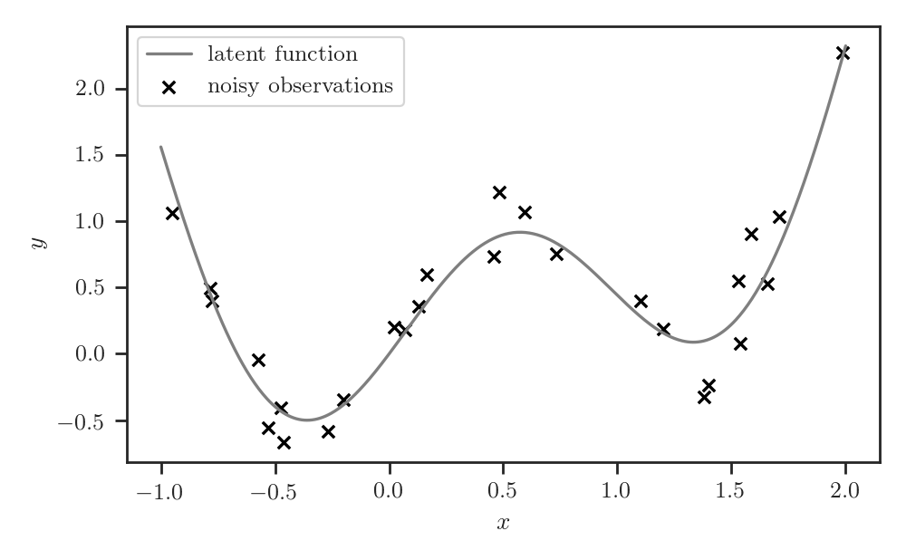
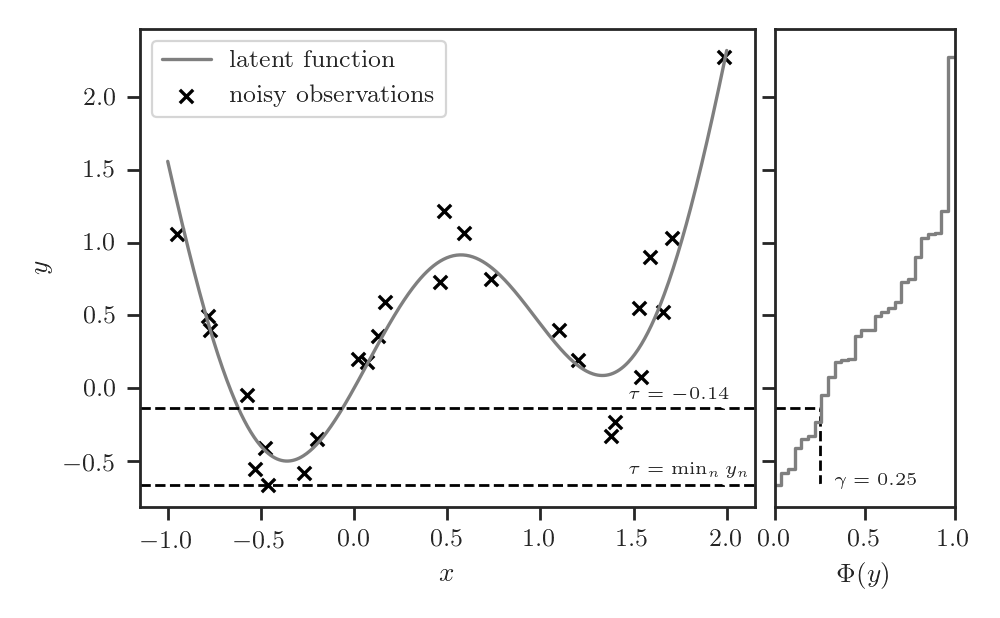
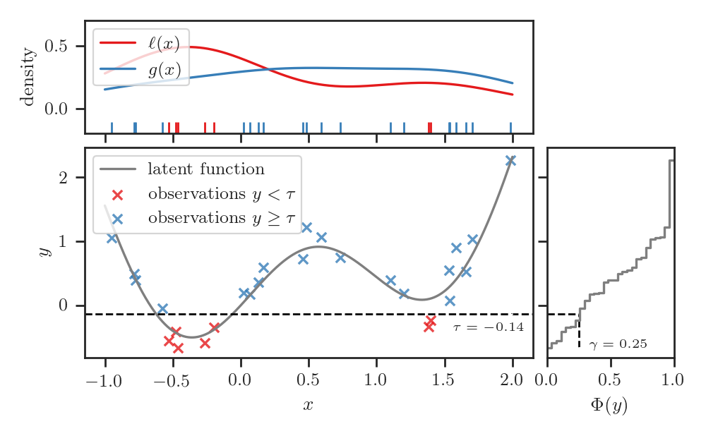
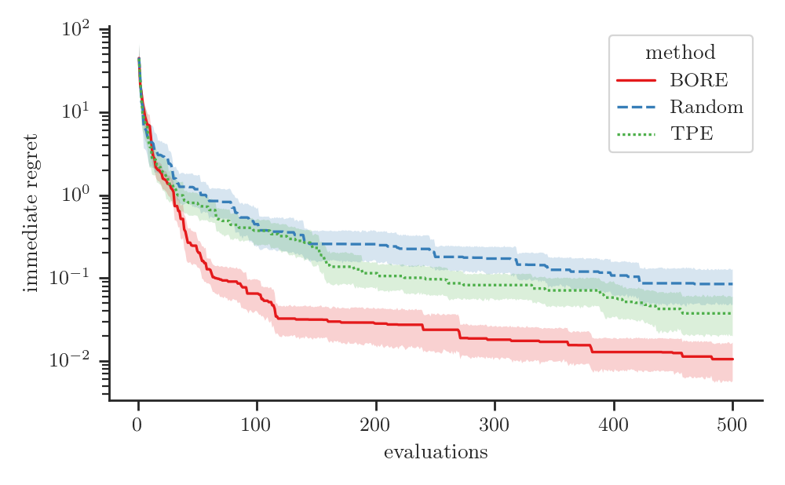
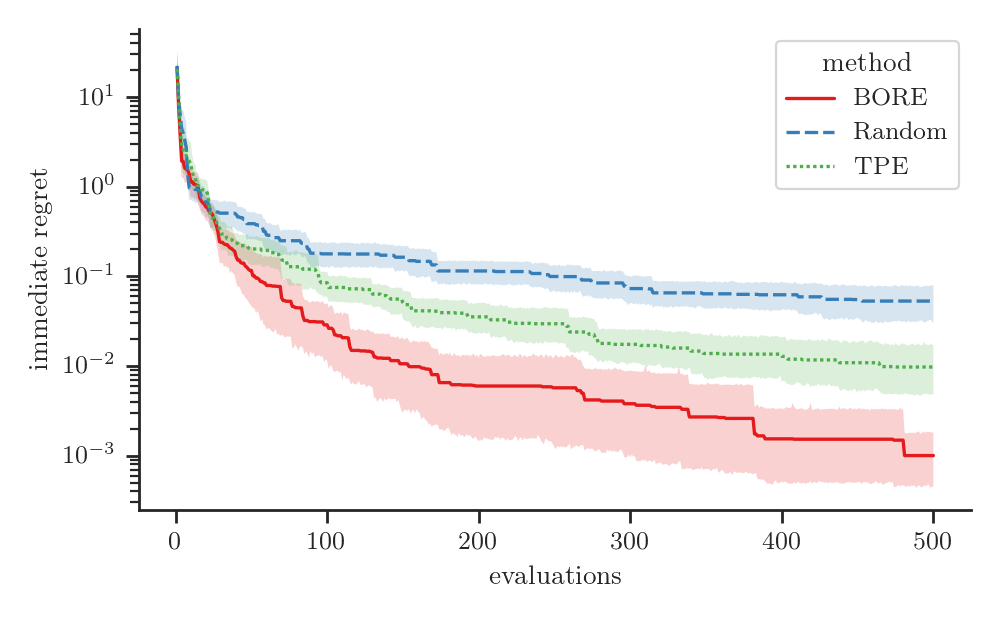
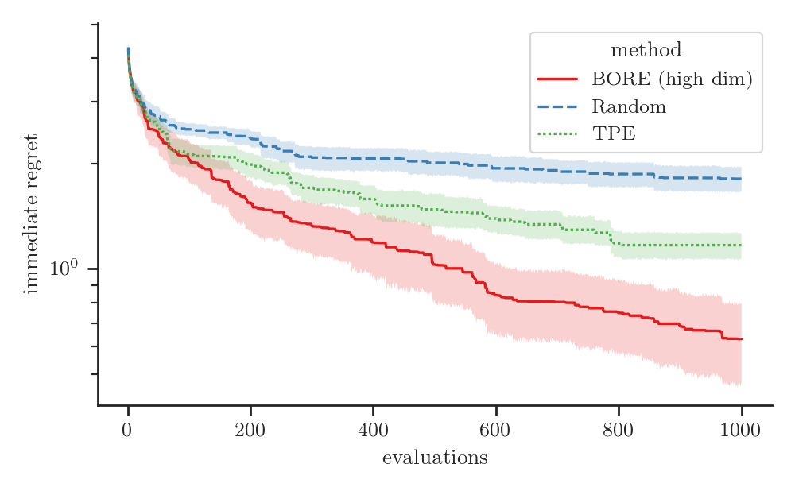
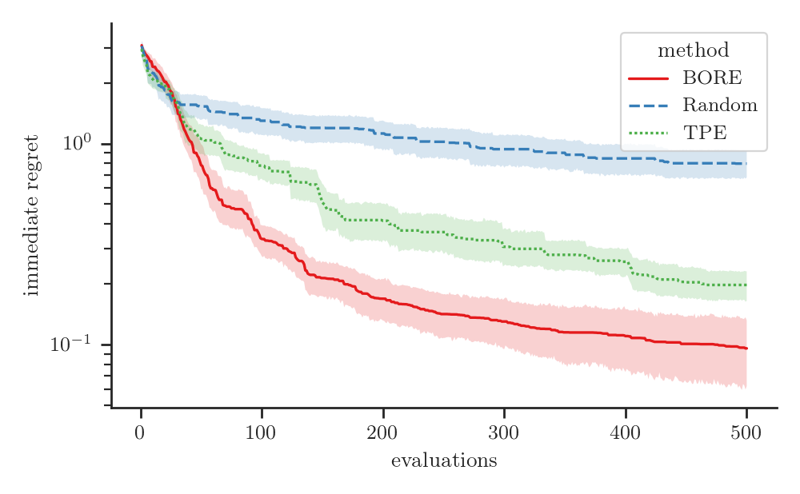

## Bayesian Optimization by Density Ratio Estimation

***

**Louis C. Tiao**, Aaron Klein, Cédric Archambeau, Edwin V. Bonilla, Matthias Seeger, and Fabio Ramos

---

## Blackbox optimization

Find input $\mathbf{x}$ that minimizes blackbox function $f(\mathbf{x})$
$$
\mathbf{x}^{\star} = \operatorname{argmin}\_{\mathbf{x} \in \mathcal{X}}{f(\mathbf{x})}
$$

 <!-- .element height="60%" width="60%" class="plain" -->

Note:
- blackbox optimization
  - global optimization
  - derivative-free optimization
- input vector of hyperparameter configuration
- output scalar

---

## Bayesian Optimization

- Output $y \sim \mathcal{N}(f(\mathbf{x}), \sigma^2)$ observed with noise variance $\sigma^2$
- Surrogate probabilistic model using past observations $\mathcal{D}\_N = \\{ (\mathbf{x}\_n, y\_n) \\}\_{n=1}^N$
- Posterior predictive distribution $p(y | \mathbf{x}, \mathcal{D}\_N)$
- Acquisition function to balance explore-exploit

----

### Utility function: Improvement 

Improvement over threshold $\tau$
$$
I\_{\gamma}(\mathbf{x}) = \max(\tau - y, 0)
$$

Note:
- non-negative improvement over tau

----

### Threshold

- Define threshold $\tau = \Phi^{-1}(\gamma)$ 
  - where $\gamma$ is some quantile of observed $y$, i.e.
$$
\gamma = \Phi(\tau) = p(y < \tau)
$$
  - for example, $\gamma=0$ leads to $\tau=\min\_n y\_n$

----

### Threshold: Examples

1. $\gamma=\frac{1}{4}$
2. $\gamma=0$ leading to $\tau=\min\_n y\_n$

 <!-- .element height="60%" width="60%" class="plain" -->

----

## Expected Improvement (EI)

- Posterior predictive
$$
p(y | \mathbf{x}, \mathcal{D}\_N)
$$
- Expected value of $I\_{\gamma}(\mathbf{x})$ under posterior predictive 
$$
\alpha\_{\gamma}(\mathbf{x}; \mathcal{D}\_N) = \mathbb{E}\_{p(y | \mathbf{x}, \mathcal{D}\_N)}[I\_{\gamma}(\mathbf{x})]
$$

----

Analytical tractability poses limitations
- scalability
- stationarity and homeoscedasticity
- discrete variables, ordered or otherwise (categorical)
- conditional dependency structures

*alternative formulation?*

*circumvent posterior predictive?*

---

## Density Ratio

The density ratio between $\ell(\mathbf{x})$ and $g(\mathbf{x})$
$$
\frac{\ell(\mathbf{x})}{g(\mathbf{x})}
$$

*1d synthetic examples here*

Note:
- Let *l(x)* and *g(x)* be probability densities.
- The *density ratio* between *l(x)* and *g(x)* is simply the ratio between 
densities *l(x)* and *g(x)*.

----

## Relative Density Ratio

- The $\gamma$-*relative* density ratio between $\ell(\mathbf{x})$ and $g(\mathbf{x})$
$$
r\_{\gamma}(\mathbf{x}) = \frac{\ell(\mathbf{x})}{\gamma \ell(\mathbf{x}) + (1 - \gamma) g(\mathbf{x})}
$$
  where $\gamma \ell(\mathbf{x}) + (1 - \gamma) g(\mathbf{x})$ is the $\gamma$-*mixture density* 
  - for some mixing proportion $0 \leq \gamma < 1$
- For $\gamma = 0$ we recover *ordinary* density ratio
$$
r\_0(\mathbf{x}) = \frac{\ell(\mathbf{x})}{g(\mathbf{x})}
$$

----

## Ordinary and Relative Density Ratio

- The relative density ratio $r\_{\gamma}(\mathbf{x})$ as a function of the 
ordinary density ratio $r\_0(\mathbf{x})$
$$
r_{\gamma}(\mathbf{x}) = ( \gamma + r_0(\mathbf{x})^{-1} (1 - \gamma) )^{-1}
$$
- Monotonically non-decreasing

---

## BORE: BO by DRE

- Let $\ell(\mathbf{x})$ and $g(\mathbf{x})$ be distributions such that
  - $\mathbf{x} \sim \ell(\mathbf{x})$ if $y < \tau$
  - $\mathbf{x} \sim g(\mathbf{x})$ if $y \geq \tau$

 <!-- .element height="60%" width="60%" class="plain" -->

Note:
- Now we get to the crux of our work
- In other words, we assume that *x* is distributed according to *l(x)* if its 
corresponding target metric *y < tau*, otherwise, it is distributed according 
to *g(x)*

----

## Define Conditional

- Instead of $p(y | \mathbf{x}, \mathcal{D}\_N)$
- Specify $p(\mathbf{x} | y, \mathcal{D}\_N)$ in terms of $\ell(\mathbf{x})$ and 
$g(\mathbf{x})$
$$
p(\mathbf{x} | y, \mathcal{D}\_N) = 
\begin{cases} 
  \ell(\mathbf{x}) & \text{if } y < \tau, \newline
  g(\mathbf{x}) & \text{if } y \geq \tau
\end{cases}
$$

----

### Relationship: EI and Density Ratio

- [Bergstra et al. 2011](#) demonstrate
$$
\underbrace{\alpha\_{\gamma}(\mathbf{x}; \mathcal{D}\_N)}\_\text{expected improvement} \propto \underbrace{r\_{\gamma}(\mathbf{x})}\_\text{relative density ratio}
$$

Note:
- Under this construction, Bergstra et al. in 2011 showed that EI is equivalent
to the *gamma*-relative density ratio, up to a constant factor. 

----

- Reduce maximizing EI to maximizing the relative density ratio
$$
\begin{align}
\mathbf{x}\^{\star} 
&= \color{red}{\operatorname{argmax}\_{\mathbf{x} \in \mathcal{X}}{\alpha\_{\gamma}(\mathbf{x}; \mathcal{D}\_N)}} \newline
&= \color{green}{\operatorname{argmax}\_{\mathbf{x} \in \mathcal{X}}{r\_{\gamma}(\mathbf{x})}}
\end{align}
$$

---

## Tree-structured Parzen Estimator (TPE)

TPE approach [(Bergstra et al. 2011)](#) for maximizing $r\_{\gamma}(\mathbf{x})$
1. Ignore $\gamma$
$$
\begin{align}
\mathbf{x}\^{\star} 
&= \operatorname{argmax}\_{\mathbf{x} \in \mathcal{X}}{\color{red}{r\_{\gamma}(\mathbf{x})}} \newline
&= \operatorname{argmax}\_{\mathbf{x} \in \mathcal{X}}{\color{green}{r\_0(\mathbf{x})}}
\end{align}
$$

----

## Shortcomings

- **Singularities.** $r\_0(\mathbf{x})$ is often undefined.
  In contrast, $r\_{\gamma}(\mathbf{x})$ is always well-defined 
  - bounded above by $\gamma^{-1}$ when $\gamma > 0$ [(Yamada et al. 2011)](#)

----

## Tree-structured Parzen Estimator (TPE) II

2. Tree-based variant of kernel density estimation (KDE)
  - separately estimate $\ell(\mathbf{x})$ and $g(\mathbf{x})$
  - estimate $r\_0(\mathbf{x})$ using the ratio of these estimates  

----

## Shortcomings II

- **Vapnik's principle.** "When solving a problem, don't try to solve a more general problem as an intermediate step"
  - *density* estimation is arguably more general and difficult problem than *density ratio* estimation

Note:

Vapnik's principle, paraphrased, suggests to us that when solving a problem of 
interest, one should refrain from resorting to solve a more general problem as 
an intermediate step.
- And in this instance, *density* estimation is a more general problem that is 
arguably more difficult than *density ratio* estimation.

----

## Shortcomings III

- **Kernel bandwidth.**
- **Error sensitivity.**
- **Curse of dimensionality.**
- **Ease of optimization.**

---

# Our Method

*someway to avoid the pitfalls of the TPE approach?*

*directly estimate the relative density ratio?*

---

## Class-Probability Estimation (CPE)

- Density ratio estimation is closely related to class-probability estimation

*references*

----

- Introduce binary variables
$$
z =
\begin{cases} 
  1 & \text{if } y < \tau, \newline
  0 & \text{if } y \geq \tau
\end{cases}
$$
- Let $\pi(\mathbf{x})$ abbreviate class-posterior probability 
$$
\pi(\mathbf{x}) = p(z = 1 | \mathbf{x})
$$

----

### Relationship: Density Ratio and Class-Posterior Probability

<!-- 
- ordinary density ratio
$$
r\_0(\mathbf{x}) = \left ( \frac{\gamma}{1 - \gamma} \right )^{-1} \frac{\pi(\mathbf{x})}{1 - \pi(\mathbf{x})}
$$ -->

- The $\gamma$-relative density ratio is exactly equivalent to the 
class-posterior probability, up to constant factor $\gamma^{-1}$
$$
\underbrace{r\_{\gamma}(\mathbf{x})}\_\text{relative density ratio} = 
\gamma^{-1}
\cdot
\underbrace{\pi(\mathbf{x})}\_\text{class-posterior probability} 
$$

---

## Quick Recap

$$
\underbrace{\alpha\_{\gamma}(\mathbf{x}; \mathcal{D}\_N)}\_\text{expected improvement} \propto \underbrace{r\_{\gamma}(\mathbf{x})}\_\text{relative density ratio}
\propto \underbrace{\pi(\mathbf{x})}\_\text{class-posterior probability} 
$$

approximated by probabilistic classifier

---

- Parameterized function
- Proper scoring rule

---

## BO Loop

Code

---

- reduced the problem of computing EI to that of training a probabilistic classifier
- enjoy the strengths and benefits different state-of-the-art classifiers have to offer
- e.g. feed-forward neural networks:
  - universal approximators
  - easily scalable with stochastic optimization
  - differentiable end-to-end wrt inputs $\mathbf{x}$

Notes:
- last but not least, differentiable end-to-end wrt inputs x

---

# Results

---

## Challenging synthetic test problems

----

## Branin (2D)

----

## Six-hump Camel (2D)

----

## Michalewicz5D (5D)

----

## Hartmann6D

---

## Meta-surrogate benchmarks for AutoML

----

## MetaSVM

----

## MetaFCNet

----

## MetaXGBoost

---

## Final Recap

- Problem of computing EI can be reduced to that of probabilistic classification
$$
\underbrace{\alpha\_{\gamma}(\mathbf{x}; \mathcal{D}\_N)}\_\text{expected improvement} \propto \underbrace{r\_{\gamma}(\mathbf{x})}\_\text{relative density ratio}
\propto \underbrace{\pi(\mathbf{x})}\_\text{class-posterior probability} 
$$
- TPE method falls short in important ways
- Simple implementation based on feed-forward NN delivers promising results

---

## Conclusion

- **Simplicity** and **effectiveness** makes BORE a promising approach
- **Extensibility** offers many exciting avenues for further exploration 

Note:
- BORE is a simple but effective alternative to conventional BO
- Its extensibility offers 

---

# Questions?

---

## References

- Bergstra, J. S., Bardenet, R., Bengio, Y., & Kégl, B. (2011). Algorithms for Hyper-parameter Optimization. In *Advances in Neural Information Processing Systems* (pp. 2546-2554).
- Yamada, M., Suzuki, T., Kanamori, T., Hachiya, H., & Sugiyama, M. (2011). Relative Density-ratio Estimation for Robust Distribution Comparison. In *Advances in Neural Information Processing Systems* (pp. 594-602).

----

## References II
