### Decoupled Sampling from Gaussian Processes

#### Phase I: Quadrature Fourier features 

***

Louis C. Tiao

---

### Sampling from Gaussian Processes

----

### Sampling from Multivariate Gaussians

- Naïve method 
$$
\mathbf{f} \sim \mathcal{N}(\boldsymbol{\mu}, \boldsymbol{\Sigma}) 
\quad \Leftrightarrow \quad 
\mathbf{f} = \boldsymbol{\mu} + \boldsymbol{\Sigma}^{\frac{1}{2}} \boldsymbol{\epsilon}, \quad
\boldsymbol{\epsilon} \sim \mathcal{N}(\mathbf{0}, \mathbf{I})
$$
- For $\ell$-dimensional Gaussian cost of $\boldsymbol{\Sigma}^{\frac{1}{2}}$ is $\mathcal{O}(\ell^3)$

Notes:
- In practice, sampling from a Gaussian process is equivalent to sampling from a multivariate Gaussian.
- Resort to location-scale transformation

----

### Exact GPs

GP posterior at $\ell$ test points $\mathbf{X}\_\*$ is $\mathbf{f}\_\* \vert \mathbf{y} \sim \mathcal{N}(\boldsymbol{\mu}, \boldsymbol{\Sigma})$, where
$$
\begin{align}
\boldsymbol{\mu} &= \mathbf{K}\_{\ell n} (\mathbf{K}\_{nn} + \sigma^2 \mathbf{I})^{-1} \mathbf{y} \newline
\boldsymbol{\Sigma} &= \mathbf{K}\_{\ell \ell} - \mathbf{K}\_{\ell n} (\mathbf{K}\_{nn} + \sigma^2 \mathbf{I})^{-1} \mathbf{K}\_{n \ell}
\end{align}
$$

----

### Sparse GPs

Variational $q(\mathbf{u}) = \mathcal{N}(\mathbf{m}, \mathbf{S})$ leads to $q(\mathbf{f}) = \mathcal{N}(\boldsymbol{\mu}, \boldsymbol{\Sigma})$
$$
\begin{align}
\boldsymbol{\mu} &= \mathbf{K}\_{\ell m} \mathbf{K}\_{mm}^{-1} \mathbf{m} \newline
\boldsymbol{\Sigma} &= \mathbf{K}\_{\ell \ell} - \mathbf{K}\_{\ell m} \mathbf{K}\_{mm}^{-1} (\mathbf{K}\_{mm} - \mathbf{S}) \mathbf{K}\_{mm}^{-1} \mathbf{K}\_{m \ell}
\end{align}
$$

----

## Matheron's rule

For jointly Gaussian random variables $\mathbf{a}$ and $\mathbf{b}$
$$
(\mathbf{a} \vert \mathbf{b} = \boldsymbol{\beta}) 
\stackrel{D}{=} 
\mathbf{a} + \mathrm{Cov}(\mathbf{a}, \mathbf{b}) \mathrm{Cov}(\mathbf{b}, \mathbf{b})^{-1} (\boldsymbol{\beta} - \mathbf{b})
$$

Notes:
- The random variable *a* conditioned on *b = beta* is equal in distribution to the expression above
- Easily verified by taking the mean and covariance of both sides

----

### Matheron's rule for GPs

- Sparse: $\mathbf{f}\_\* \vert \mathbf{u} = \mathbf{f}\_\* + \mathbf{K}\_{\ell m} \mathbf{K}\_{mm}^{-1} (\mathbf{u} - \mathbf{f}\_m)$
- Exact: $\mathbf{f}\_\* \vert \mathbf{y} = \mathbf{f}\_\* + \mathbf{K}\_{\ell n} (\mathbf{K}\_{nn} + \sigma^2 \mathbf{I})^{-1} (\mathbf{y} - \mathbf{f} - \boldsymbol{\epsilon})$
- *But is this any better?* Sampling $\mathbf{f}\_\* \sim \mathcal{N}(\mathbf{0}, \mathbf{K}\_{\ell \ell})$ costs $\mathcal{O}(\ell^3)$. 
- Actually, it's *worse*! - jointly sampling $\mathbf{f}\_\*, \mathbf{f}\_m$ costs $\mathcal{O}((\ell + m)^3)$

----

### Matheron's rule for BLR

- Weight-space approximation *(more on this later)*
$$
\mathbf{w} \vert \mathbf{y} = \mathbf{w} + \boldsymbol{\Phi}^\top (\boldsymbol{\Phi} \boldsymbol{\Phi}^\top + \sigma^2\mathbf{I})^{-1} (\mathbf{y} - \boldsymbol{\Phi}\mathbf{w} - \boldsymbol{\epsilon})
$$
- More *efficient* but less *accurate*
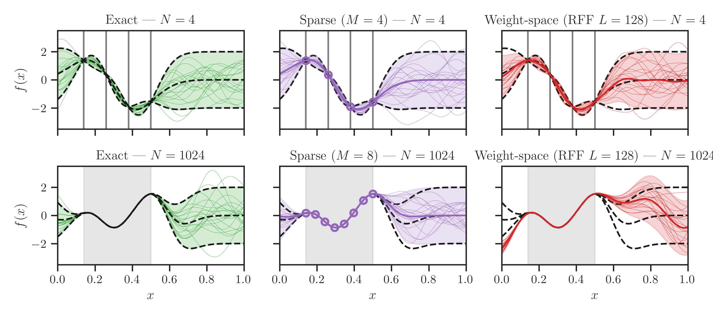

----

### Summary

| Paradigm     | Post.                               | Prior                               | Update                                                                    |
| :----------- | :---------------------------------: | :---------------------------------: | :-----                                                                    |
| GPs (Sparse)  | $\mathbf{f}\_\* \vert \mathbf{u}$  | $\color{OrangeRed}{\mathbf{f}\_\*}$ | $\color{ForestGreen}{\mathbf{K}\_{\ell m} \mathbf{K}\_{mm}^{-1} (\mathbf{u} - \mathbf{f}\_m)}$ |
| GPs (Exact) | $\mathbf{f}\_\* \vert \mathbf{y}$    | $\color{OrangeRed}{\mathbf{f}\_\*}$ | $\color{ForestGreen}{\mathbf{K}\_{\ell n} (\mathbf{K}\_{nn} + \sigma^2 \mathbf{I})^{-1} (\mathbf{y} - \mathbf{f} - \boldsymbol{\epsilon})}$ |
| Weight-space | $\boldsymbol{\Phi}\_\* \mathbf{w} \vert \mathbf{y}$       | $\color{ForestGreen}{\boldsymbol{\Phi}\_\*\mathbf{w}}$   | $\color{OrangeRed}{\boldsymbol{\Phi}\_\* \boldsymbol{\Phi}^\top (\boldsymbol{\Phi} \boldsymbol{\Phi}^\top + \sigma^2\mathbf{I})^{-1} (\mathbf{y} - \boldsymbol{\Phi}\mathbf{w} - \boldsymbol{\epsilon})}$ |

----

### Decoupled Sampling 

| Paradigm     | Post.                               | Prior                               | Update                                                                    |
| :----------- | :---------------------------------: | :---------------------------------: | :-----                                                                    |
| GPs (Sparse)  | $\mathbf{f}\_\* \vert \mathbf{u}$  | $\color{ForestGreen}{\boldsymbol{\Phi}\_\* \mathbf{w}}$ | $\color{ForestGreen}{\mathbf{K}\_{\ell m} \mathbf{K}\_{mm}^{-1} (\mathbf{u} - \boldsymbol{\Phi} \mathbf{w})}$ |
| GPs (Exact) | $\mathbf{f}\_\* \vert \mathbf{y}$    | $\color{ForestGreen}{\boldsymbol{\Phi}\_\*  \mathbf{w}}$ | $\color{ForestGreen}{\mathbf{K}\_{\ell n} (\mathbf{K}\_{nn} + \sigma^2 \mathbf{I})^{-1} (\mathbf{y} - \boldsymbol{\Phi} \mathbf{w} - \boldsymbol{\epsilon})}$ |

Note:
- Fourier basis is well-suited for representing the prior
- Canonical basis is well-suited for representing the data

---

### Weight-space Perspective

----

### Mercer's theorem

- Decomposition (infinite-dimensional generalisation of matrix diagonalisation)
$$
k(\mathbf{x}, \mathbf{x}') = \sum\_{m=1}^{\infty} \lambda\_m \phi\_m(\mathbf{x}) \phi\_m(\mathbf{x}')
$$
- $M$-dimensional weight-space approximation to a Gaussian process 
$$
f(\cdot) = \sum\_{m=1}^{M} w\_m \phi\_m(\cdot), \qquad w\_m \sim \mathcal{N}(0, 1)
$$

Notes:
- Mercer's theorem - not restated here
- Think of it as an analogue

----

### Bochner's theorem

- Shift-invariance $k(\mathbf{x}, \mathbf{x}') = k(\mathbf{x} - \mathbf{x}', \mathbf{0})$
- **Theorem:** *A continuous, shift-invariant kernel is positive definite iff it is the 
Fourier transform of a nonnegative, finite measure*
$$
\begin{align}
k(\mathbf{x} - \mathbf{x}', \mathbf{0}) & = \int p(\boldsymbol{\omega}) e^{- i \boldsymbol{\omega}^{\top} (\mathbf{x} - \mathbf{x}')} \\, \mathrm{d}\boldsymbol{\omega} \newline
& = \mathbb{E}\_{p(\boldsymbol{\omega})}[e^{-i \boldsymbol{\omega}^{\top} (\mathbf{x} - \mathbf{x}')}] 
\end{align}
$$

Note:
A more general statement:
A complex-valued function is the covariance function of a weakly stationary 
mean square continuous complex-valued random process if and only if it can be 
represented in this form.

----

### Bochner's thm in practice I

#### Keeping it Real

- Since spectral density $p(\boldsymbol{\omega})$ and kernel $k(\boldsymbol{\tau}, \mathbf{0})$ are *real*, we consider real part of eigenfunctions 
$$
\Re(e^{-i\boldsymbol{\omega}^{\top}(\mathbf{x} - \mathbf{x}')}) = \cos{(\boldsymbol{\omega}^{\top}(\mathbf{x} - \mathbf{x}'))}
$$
- i.e.
$$
k(\mathbf{x} - \mathbf{x}', \mathbf{0}) = 
\mathbb{E}\_{p(\boldsymbol{\omega})}[\cos{(\boldsymbol{\omega}^{\top}(\mathbf{x} - \mathbf{x}'))}] 
$$

Notes:
- A stationary kernel is positive-definite iff it is the Fourier transform of a non-negative measure p(omega).

----

### Bochner's thm in practice II

#### Basic Trigonometry

$$
\begin{align}
k(\mathbf{x}, \mathbf{x}') & =
\mathbb{E}\_{p(\boldsymbol{\omega})}[\cos{(\boldsymbol{\omega}^{\top}(\mathbf{x} - \mathbf{x}'))}] \newline & =
\begin{split}
\mathbb{E}\_{p(\boldsymbol{\omega})}[& \sin{(\boldsymbol{\omega}^{\top} \mathbf{x})} \sin{(\boldsymbol{\omega}^{\top} \mathbf{x}')} + \newline
                                     & \qquad \cos{(\boldsymbol{\omega}^{\top} \mathbf{x})} \cos{(\boldsymbol{\omega}^{\top} \mathbf{x}')}] 
\end{split} \newline & =
\mathbb{E}\_{p(\boldsymbol{\omega})}[\phi\_{\boldsymbol{\omega}}(\mathbf{x})^{\top} \phi\_{\boldsymbol{\omega}}(\mathbf{x}')], 
\quad \phi\_{\boldsymbol{\omega}}: \mathbf{x} \mapsto 
\begin{bmatrix} 
  \sin{(\boldsymbol{\omega}^{\top} \mathbf{x})} 
  \newline 
  \cos{(\boldsymbol{\omega}^{\top} \mathbf{x})}
\end{bmatrix}
\end{align}
$$

----

### Bochner's thm in practice III

#### Monte Carlo estimation feature maps

$$
\begin{align}
k(\mathbf{x}, \mathbf{x}') & =
\mathbb{E}\_{p(\boldsymbol{\omega})}[\phi\_{\boldsymbol{\omega}}(\mathbf{x})^{\top} \phi\_{\boldsymbol{\omega}}(\mathbf{x}')] \newline & \approx
\frac{1}{M/2} \sum\_{m=1}^{M/2} \phi\_{\boldsymbol{\omega}^{(m)}}(\mathbf{x})^{\top} \phi\_{\boldsymbol{\omega}^{(m)}}(\mathbf{x}'), 
  \quad \boldsymbol{\omega}^{(m)} \sim p(\boldsymbol{\omega}) \newline 
  & = \boldsymbol{\phi}(\mathbf{x})^{\top} \boldsymbol{\phi}(\mathbf{x}'), 
  \quad 
  \boldsymbol{\phi}: \mathbf{x} \mapsto \sqrt{\frac{2}{M}} 
  \begin{bmatrix} 
    \phi\_{\boldsymbol{\omega}^{(1)}}(\mathbf{x})
    \newline 
    \vdots 
    \newline 
    \phi\_{\boldsymbol{\omega}^{(M/2)}}(\mathbf{x})
  \end{bmatrix}
\end{align}
$$

---

### Quadrature Fourier features

----

### Gauss-Hermite Quadrature

- Approximate integrals of form
$$
\int \exp{(-u^2)} f(u) \\, \mathrm{d}u
\approx \sum\_{m=1}^M \color{MidnightBlue}{\alpha\_m} f(\color{MidnightBlue}{u\_m})
$$
- $\color{MidnightBlue}{u\_m}$ are roots of Hermite polynomial $H\_M(u)$
- $\color{MidnightBlue}{\alpha\_m}$ associated weights
$$
\color{MidnightBlue}{\alpha\_m} = \frac{2^{M-1}M!\sqrt{\pi}}{M^2 [H\_{M-1}(\color{MidnightBlue}{u\_m})]^2}
$$

----

### Gaussian Integrals

- Approximate expectations $\mathbb{E}\_{p(\omega)}[f(\omega)]$ with $p(\omega) = \mathcal{N}(\mu, \sigma^2)$
$$
\mathbb{E}\_{p(\omega)}[f(\omega)] = 
\int \underbrace{\frac{1}{\sqrt{2\pi\sigma^2}}\exp{\left(-\frac{(\omega-\mu)^2}{2\sigma^2}\right)}}\_{\mathcal{N}(\mu, \sigma^2)} f(\omega) \\, \mathrm{d}\omega
$$

----

#### Variable substitution

- Change of variables $u = \frac{\omega - \mu}{\sqrt{2}\sigma} \Leftrightarrow \omega = \sqrt{2} \sigma u + \mu$
- Therefore
$$
\begin{align}
\mathbb{E}\_{p(\omega)}[f(\omega)] & = 
\frac{1}{\sqrt{\pi}} \int \exp{(-u^2)} f(\sqrt{2} \sigma u + \mu) \\, \mathrm{d}u \newline & \approx 
\frac{1}{\sqrt{\pi}} \sum\_{m=1}^M \color{MidnightBlue}{\alpha\_m} f(\sqrt{2} \sigma \color{MidnightBlue}{u\_m} + \mu)
\end{align}
$$

----

#### Quadrature Fourier features

- For squared exponential kernels $k(\tau, 0) = \exp{\left (- \frac{\tau^2}{2\ell^2} \right )}$ where $\tau = x - x'$, 
we have $p(\omega) = \mathcal{N}(0, 1/\ell^{2})$
- Apply Gauss-Hermite quadrature
$$
\begin{align}
k(x, x') & =
\mathbb{E}\_{p(\omega)}[\phi\_{\omega}(x)^{\top} \phi\_{\omega}(x')], 
\quad \phi\_{\omega}: x \mapsto 
\begin{bmatrix} 
  \sin{(\omega x)} 
  \newline 
  \cos{(\omega x)}
\end{bmatrix} \newline & \approx 
\frac{1}{\sqrt{\pi}} \sum\_{m=1}^{M/2} \color{MidnightBlue}{\alpha\_m} \phi\_{(\sqrt{2} \color{MidnightBlue}{u\_m} / \ell)}(x)^{\top} \phi\_{(\sqrt{2} \color{MidnightBlue}{u\_m} / \ell)}(x') 
\end{align}
$$

Notes:
- The spectral density of squared exponential kernels with characteristic lengthscale *ell* are Gaussians with zero-mean and variance *1/ell*
- We can readily apply Gauss-Hermite quadrature to approximate the expectation *shown here* 

----

### Quadrature feature maps

$$
\begin{align}
k(x, x') & \approx
\frac{1}{\sqrt{\pi}} \sum\_{m=1}^{M/2} \color{MidnightBlue}{\alpha\_m} \phi\_{(\sqrt{2} \color{MidnightBlue}{u\_m} / \ell)}(x)^{\top} \phi\_{(\sqrt{2} \color{MidnightBlue}{u\_m} / \ell)}(x') \newline 
  & = \boldsymbol{\phi}(x)^{\top} \boldsymbol{\phi}(x'), 
  \quad 
  \boldsymbol{\phi}: x \mapsto \pi^{-\frac{1}{4}} 
  \begin{bmatrix} 
    \sqrt{\color{MidnightBlue}{\alpha\_1}} \phi\_{(\sqrt{2} \color{MidnightBlue}{u\_1} / \ell)}(x)
    \newline 
    \vdots 
    \newline 
    \sqrt{\color{MidnightBlue}{\alpha\_{M/2}}} \phi\_{(\sqrt{2} \color{MidnightBlue}{u\_{M/2}} / \ell)}(x)
  \end{bmatrix}
\end{align}
$$

----

#### Multi-dimensional Gauss-Hermite Quadrature

- Cartesian product of $K$ quadrature nodes in 1D
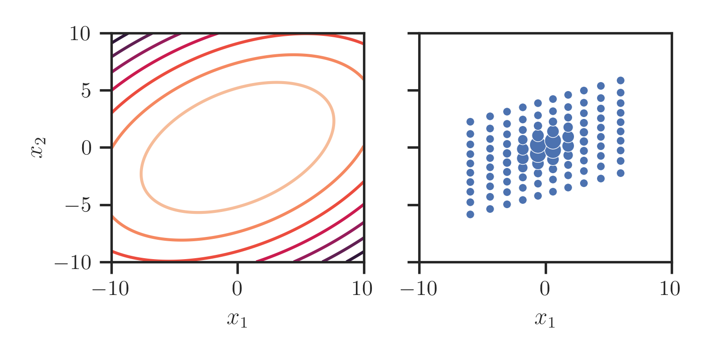
- $D$-dimensional Gaussian results in $K^D$ nodes!

----

### Code

Now available in GPflux

<pre>
<code class="python" data-line-numbers="2|4|9">
from gpflux.layers.basis_functions.fourier_features import (
  RandomFourierFeatures, 
  QuadratureFourierFeatures
)
from gpflux.sampling import KernelWithFeatureDecomposition

n_components = 8
eigen_funcs = QuadratureFourierFeatures(kernel, n_components)
eigen_vals = np.ones((n_components, 1))
kernel_approx = KernelWithFeatureDecomposition(
  kernel, 
  eigen_funcs,
  eigen_vals
)
</code>
</pre>

----

### Example

<pre>
<code class="python">
>>> X_grid = np.linspace(-5, 5, 512).reshape(-1, 1)
>>> Z = basis_func(X_grid)
>>> Z.shape  # [512, 2 * n_components]
TensorShape([512, 16])
</code>
</pre>

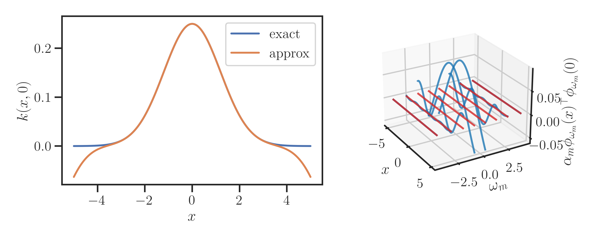

----

#### Addendum: Squared exponential kernel spectrum

- Squared exponential kernel $k(\tau, 0) = \exp{\left (- \frac{\tau^2}{2\ell^2} \right )}$ where $\tau = x - x'$.
- Spectral density (inverse Fourier transform)
$$
\begin{align}
p(\omega) & = 
\frac{1}{2\pi} 
\int k(\tau, 0) 
e^{i\omega \tau} \\, \mathrm{d}\tau \newline & = 
\frac{\ell}{\sqrt{2\pi}} 
\int \mathcal{N}(\tau \vert 0, \ell^2) 
e^{i\omega \tau} \\, \mathrm{d}\tau \newline & = 
\frac{\ell}{\sqrt{2\pi}} \exp{\left (- \frac{1}{2} \ell^2 \omega^2 \right )} = 
\mathcal{N}(\omega \vert 0, 1/\ell^2)
\end{align}
$$

---

## Results

----

### Synthetic 1D Example

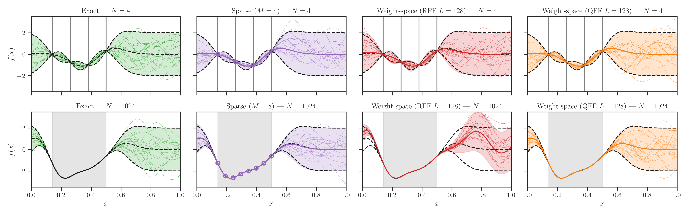

----

## Kernel Profile

<video data-autoplay src="foo.mp4"></video>

----

### Kernel profile

<video data-autoplay src="media/videos/subplots/1080p60/Subplots.mp4"></video>

<!-- .slide: data-background-color="black" -->

----

### Don't be fooled...

<!-- .slide: data-background-color="black" -->

----

### The Bigger Picture

<video data-autoplay src="media/videos/zoomed1d/1080p60/QuadratureZoomed1D.mp4"></video>

<!-- .slide: data-background-color="black" -->

----

### The Bigger Picture

<video data-autoplay src="media/videos/zoomed1d/1080p60/RandomZoomed1D.mp4"></video>

<!-- .slide: data-background-color="black" -->

----

### The curse of small lengthscales

<video data-autoplay src="media/videos/subplots/1080p60/SmallLengthscaleSubplots.mp4"></video>

<!-- .slide: data-background-color="black" -->

Note:

- QFF: When it's right, it's nearly perfect. But when it's wrong, it's *really* wrong.
- RFF: Somewhat right and somewhat wrong all of the time.
- Reminiscent of the bias-variance decomposition
  - RFF has low-bias, high-variance
  - QFF has high-bias, low-variance

---

### Uncertainty calibration

#### 2-Wasserstein distance

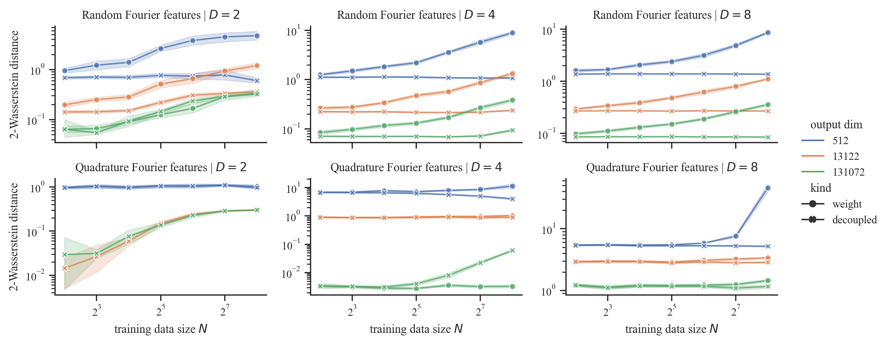

----

### Synthetic 1D Example

#### Run 1

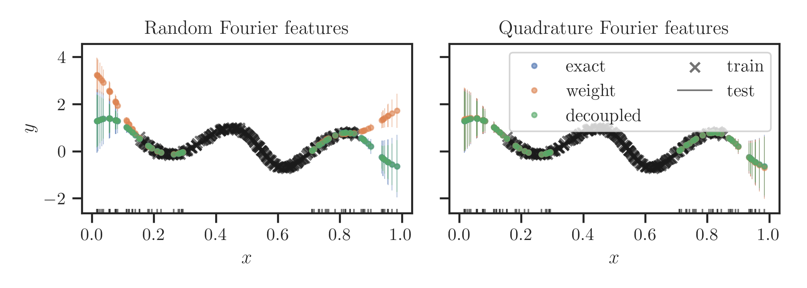

----

### Synthetic 1D Example

#### Run 2

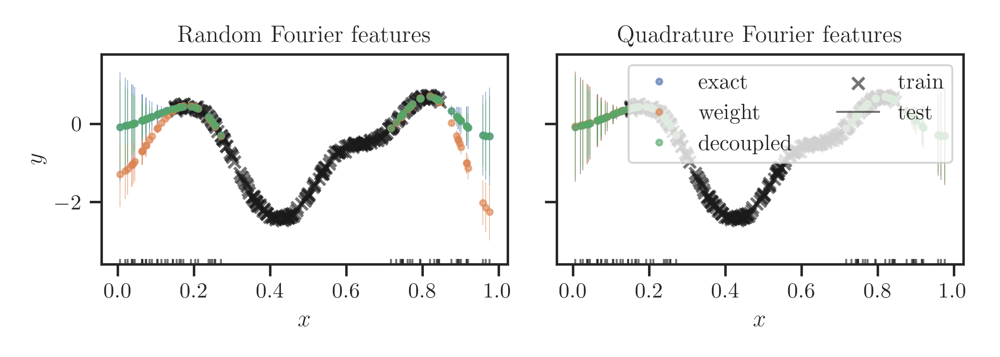

----

### Synthetic 1D Example

#### Run 3

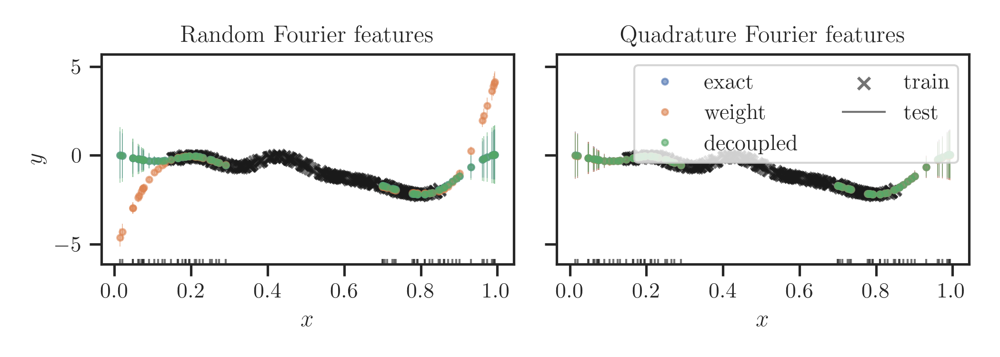

----

### Synthetic 1D Example

#### Run 4

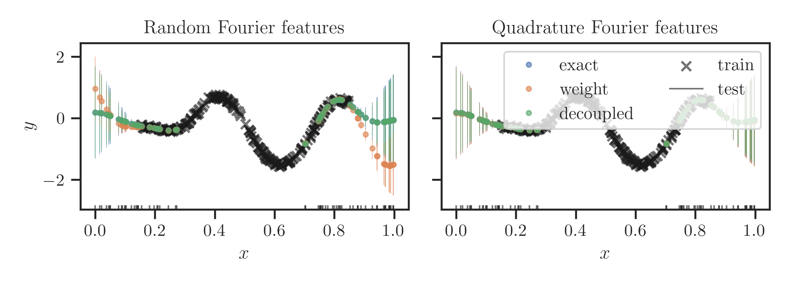

----

### Synthetic 1D Example

#### Run 5

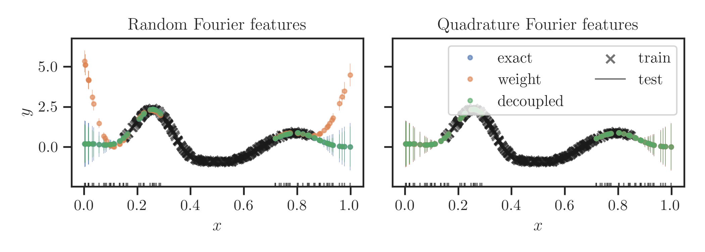

----

### Synthetic 1D Example

#### Run 6

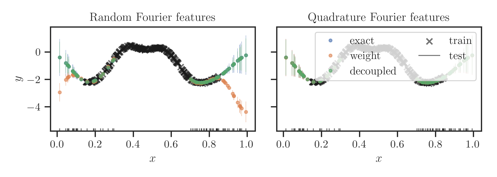

----

### Synthetic 1D Example

#### Run 7

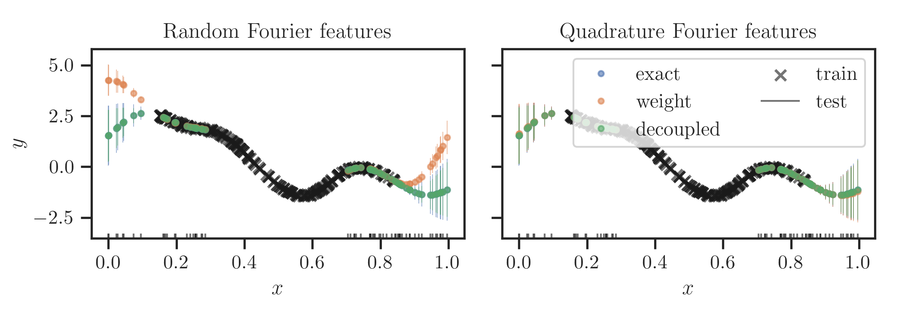

---

### General Recipe

$$
\begin{align}
k(\mathbf{x}, \mathbf{x}') & =
\mathbb{E}\_{p(\boldsymbol{\omega})}[\phi\_{\boldsymbol{\omega}}(\mathbf{x})^{\top} \phi\_{\boldsymbol{\omega}}(\mathbf{x}')] \newline & \stackrel{\star}{\approx} 
\sum\_{m=1}^{M} \alpha\_m \phi\_{\boldsymbol{\omega}\_m}(\mathbf{x})^{\top} \phi\_{\boldsymbol{\omega}\_m}(\mathbf{x}'), \newline 
  & \stackrel{\dagger}{=} \boldsymbol{\phi}(\mathbf{x})^{\top} \boldsymbol{\phi}(\mathbf{x}')
\end{align}
$$

1. Find a way to approximate integral with $\star$
2. Construct $\boldsymbol{\phi}: \mathbb{R}^D \to \mathbb{R}^M$ that satisfies $\dagger$

----

### Other methods

- Fastfood [(Le et al. 2013)](#) 
  - loglinear in $D$ -  $\mathcal{O}(M \log{D})$
- Quasi-random (Monte Carlo) Fourier features (QMCFF) [(Yang et al. 2014)](#)
  - convergence $\mathcal{O}((\log M)^D / M)$ instead of $\mathcal{O}(1 / \sqrt{M}$)
- Orthogonal random (Fourier) features (ORF) [(Yu et al. 2016)](#)

----

### Available in GPflux

- Orthogonal random (Fourier) features (ORF): **Yes**
- Quasi-random (Monte Carlo) Fourier features (QMCFF): **Draft PR**
- Fastfood: **WIP**

---

### Open Issues

1. Small lengthscales prohibit its use
2. Quadrature schemes for spectral densities beyond Gaussians (e.g. Student's-$t$ for the Matérn family) 

----

### Next Steps

1. Comparisons with other methods (ORF, QMCFF, Fastfood, etc.)
2. Understand the downstream effects of QFF's poor behaviour (i.e. effects on the posterior)

---

## Questions?

---

## References
